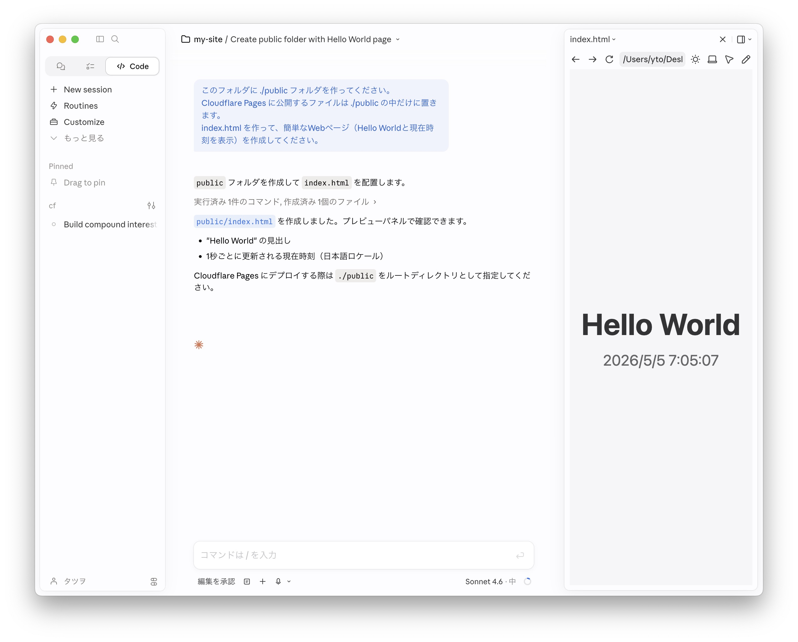
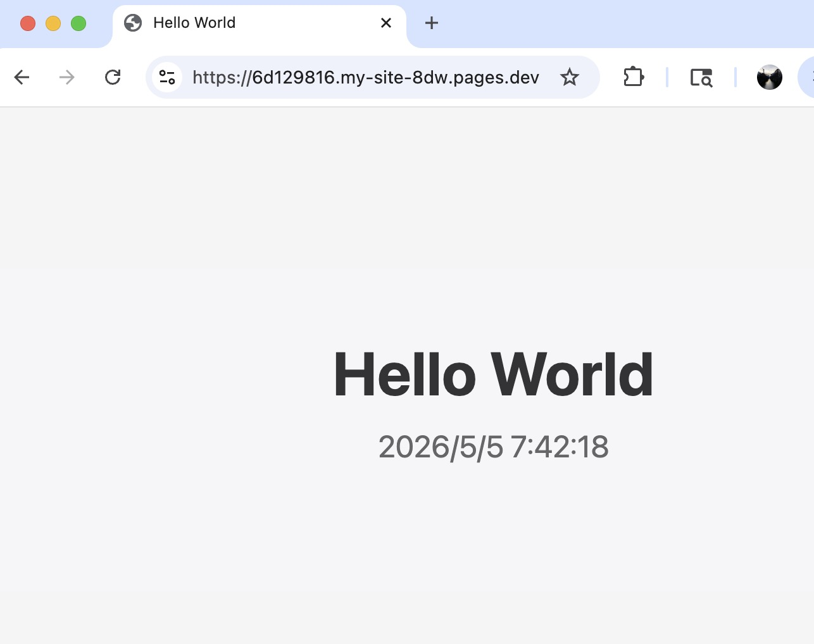

# Claude CodeでWebアプリを作ってWranglerでCloudflare Pagesに公開する

[前回のハンズオン](cloudflare-pages-static-files.html)では、Cloudflareに静的ファイルをドラッグ＆ドロップしてWebページをデプロイ（本番環境への公開・反映）した。今回はその発展として、コマンド操作（CLI）でデプロイできるようになることを目指す。これにより、Claude Codeにデプロイ依頼ができ、開発作業がはかどる。

## 1. Node.js と Wrangler のセットアップ

Wrangler は Cloudflare が公式に提供する CLI ツール（コマンドラインツール）で、Cloudflare へのログインや Cloudflare Pages へのデプロイに使う。この章ではローカルマシンに Wrangler をインストールする。なお、Wrangler は Node.js 上で動くため、Node.js も合わせてインストールする。

まずターミナルを開く。ターミナルを開くには `Command + Space` → "terminal" と入力。

### Node.js のインストール

```bash
# インストール済みか確認
node -v
```

v22以上が表示されればOK（Homebrewなど他の方法で入れていても問題なし）。なにもせずに次に進む。

`command not found` またはv21以下の場合はインストールが必要となる。
[Node.js 公式サイト](https://nodejs.org)を開き、**LTS版** の **macOS 64-bit Installer**（`.pkg`ファイル）をダウンロードしてインストールする。インストール後に `npm` と `npx` が使えるようになる。

<a href="images/cf-d1-nodejs.jpg" target="_blank"></a>

> **LTS（Long Term Support）とは？** 「安定版」のこと。公式サイトに「LTS」と「最新/Current」の2種類があるが、LTS を選ぶのが定番。

### Wrangler のインストールとログイン

インストール：

```bash
npm install -g wrangler
```

WranglerでCloudflareにログイン：

```bash
wrangler login
```

ブラウザが開いてCloudflareのOAuth認証画面が表示される。承認するとCLIから操作できるようになる。

<a href="images/cf-d1-cfoauth.jpg" target="_blank"></a>

## 2. 作業場所を確保する

まずは作業場所（フォルダ）を作成する。例えば、デスクトップの "my-site" フォルダ。   
Finderでフォルダを作るか、ターミナルで下記のコマンドを実行する。

```bash
mkdir ~/Desktop/my-site
```

> `mkdir` はフォルダを作成するコマンド

ターミナル内で作業場所に移動する。

```bash
cd ~/Desktop/my-site
```

> `cd` はフォルダを移動するコマンド

## 3. Claude CodeでWebアプリを作る

デスクトップ版Claudeアプリを起動。

**Code**（Claude Code）を選択 → **New session** をクリック → 作業ディレクトリを指定（`~/Desktop/my-site`）

下記のプロンプトを実行して、時計Webアプリを作る:

```
このフォルダに ./public フォルダを作ってください。
Cloudflare Pages に公開するファイルは ./public の中だけに置きます。
index.html を作って、簡単なWebページ（Hello Worldと現在時刻を表示）を作成してください。
```

なお、途中でファイル操作の許可を求められることがあるので、その都度許可する。

<a href="images/cf-wr-app.jpg" target="_blank"></a>

完成したらFinderで **デスクトップ** → **my-site** → **public** フォルダを開き、`index.html` をダブルクリックしてブラウザで表示を確認する。

## 4. Cloudflare Pagesにデプロイ

下記のコマンドをターミナルで実行する。Claude Codeへのプロンプトとしてそのまま渡してもよい。

```bash
wrangler pages deploy ./public --project-name my-site
```

実行すると `public` フォルダの中身がCloudflare Pagesにデプロイされ、ウェブに公開される。

ターミナルでの実行結果:

```bash
 ⛅️ wrangler 4.87.0
───────────────────
✔ The project you specified does not exist: "my-site". Would you like to create it? › Create a new project
✔ Enter the production branch name: … production
✨ Successfully created the 'my-site' project.
✨ Success! Uploaded 1 files (1.52 sec)

🌎 Deploying...
✨ Deployment complete! Take a peek over at https://6d129816.my-site-8dw.pages.dev
```

初回は「プロジェクトが存在しない。作成しますか？」と聞いてくる。**Create a new project** を選んでEnter。続いてブランチ名を聞かれるので、そのままEnterで `production` にする。

デプロイメントURL（`https://xxxxxxxx.my-site-xxx.pages.dev`）が表示されるので、ブラウザで開いて確認する。デプロイのたびに異なるURLが発行され、その時点のサイトのスナップショットとして機能する。

<a href="images/cf-wr-durl.jpg" target="_blank"></a>

本番URL（`https://my-site-xxx.pages.dev`）はデプロイメントURLから先頭のランダムな英数文字列（上の例では `6d129816`）を取り除いたもの。プロジェクトごとに固定で、常に最新のデプロイを指す。人に共有するときはこの本番URLを使う。

> **補足:** 今回は1ファイル構成だが、複数のファイルやサブフォルダを含むWebサイトでも同様にデプロイできる。


## 5. 修正して再デプロイ

ファイルを修正する。Claude Codeに依頼:

```
index.html は黒背景に白文字にして
```

修正を確認したら、同じコマンドで再デプロイする。
ターミナルで実行するか、Claude Codeへのプロンプトとして渡す。

```bash
wrangler pages deploy ./public --project-name my-site
```

ターミナルでの実行結果:

```bash
 ⛅️ wrangler 4.87.0
───────────────────
✨ Success! Uploaded 1 files (0.99 sec)

🌎 Deploying...
✨ Deployment complete! Take a peek over at https://3e21a7d6.my-site-8dw.pages.dev
```

デプロイメントURL（先ほどのとは異なる）と本番URL（固定）をブラウザで開き、変更が反映されていることを確認する。

なお、Claude CodeからWranglerのコマンドを実行した場合、同じセッション内であれば、「デプロイして」と依頼するだけでコマンドを実行してくれるようになる。セッションをまたいでも同じようにしたい場合は、作業フォルダに `CLAUDE.md` というファイルを作り、「デプロイは `wrangler pages deploy ./public --project-name my-site` を実行する」と書いておくとよい。

## 6. 次のステップ

このハンズオンでは、Wranglerを使ってコマンドラインからCloudflare Pagesにデプロイする方法を学んだ。さらに進みたい場合は以下を参考に。

- [GitHub初心者ガイド](github-guide-first-step.html) — コードをGitHubで管理する方法を学ぶ。バージョン管理の基本から始めたい人向け。
- [Claude CodeでWebアプリを作ってCloudflare Pagesで公開する](claude-code-web-app-cloudflare-pages.html) — GitHubと連携した本格的なデプロイフローにステップアップ。

---
2026-05-05　タツヲ ([yto](https://x.com/yto))
