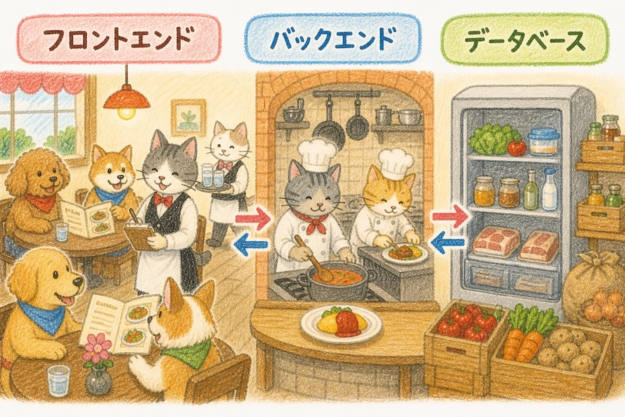

# Claude CodeでDB付きWebアプリを作ってCloudflareで公開するバイブコーディングハンズオン

<p class="subtitle">Cloudflare Pages + Pages Functions + D1 実践ガイド</p>

このハンズオンを始める前に、[Cloudflareで「みんなで使える」Webアプリを作るための基礎知識](cloudflare-architecture-guide.html)を必ず読んでおいてください。また、[GitHub初心者ガイド](github-guide-first-step.html)と[Cloudflare Pagesハンズオン](claude-code-web-app-cloudflare-pages.html)も完了しておいてください。


## このハンズオンで作るもの

**匿名一行掲示板**を作ります。

- 名前の入力不要。書き込むだけで投稿できます
- 書き込んだ人には自動的に「会員1号」「会員2号」と番号が割り振られます
- 同じブラウザから書き込むと、次回以降も同じ会員番号が使われます
- みんなの投稿を一覧表示します

このハンズオンで学ぶこと：

- Cloudflare D1（データベース）の作成と設定
- Cloudflare Pages Functions（バックエンドAPI）の実装
- Claude Codeとのデータベース設計の進め方
- GitHub Actionsを使ったD1マイグレーションの自動化

新たに登場するもの：

| 名前 | 役割 |
|---|---|
| Cloudflare D1 | データベース（SQLite） |
| Cloudflare Pages Functions | バックエンドAPI |
| wrangler.toml | プロジェクト設定ファイル |
| マイグレーション | データベースの構造変更を管理・適用する仕組み |
| GitHub Actions | D1マイグレーションの自動実行 |
| Wrangler | ローカル開発ツール（オプション） |

### 「Claude Codeに全部作って」ではダメなの？

「Cloudflare Pages + D1で匿名一行掲示板を作って」とClaude Codeに一言伝えるだけでも、コードはほぼ完成します。ではなぜ手順を追うのか。

理由は2つあります。

1つ目は、**Claude Codeが代わりにできない手作業があるから**です。CloudflareダッシュボードでのD1バインディングの設定、GitHub SecretsへのAPI Token登録など、ブラウザ上でのクリック操作はClaude Codeには頼めません。「次に何をすればいい？」とその都度Claude Codeに聞きながら進める方法もありますが、それだと全体像がわからないまま「言われた通りにクリックしている」状態になりがちです。何のためにこの設定をしているのかが見えないまま進むのは、トラブルが起きたときに特につらい。

2つ目は、**自分の理解とスキルが上がるから**です。構成を理解した上でDB設計をClaude Codeと一緒に考えるプロセスは、次のアプリ開発でも使えるパターンとして身につきます。「掲示板の次は〇〇を作りたい」となったとき、一から手順を追った経験があると、自分でアレンジしながら進められるようになります。


## 1. プロジェクトの準備

### 1-1. GitHubリポジトリを作る

前回のハンズオンと同じ手順で、新しいリポジトリを作成します。

1. GitHubで新しいリポジトリを作成（例：`bbs`）
   - **Privateに設定してください**。慣れないうちは認証情報などを誤ってコミットしてしまうリスクがあります。CloudflareのGitHub連携はPrivateリポジトリでも動作します
2. ローカルにクローン
3. Claude Codeで開く

### 1-2. Cloudflare Pagesと連携する

前回のハンズオンと同じ手順で、Cloudflare PagesとGitHubリポジトリを連携します。

1. Cloudflareダッシュボード → Workers & Pages → Create
2. Pages → Connect to Git
3. 作成したリポジトリを選択して連携
4. Build settings：ビルドコマンドは空欄、出力ディレクトリは `/`

### 1-3. wrangler.tomlを作る

`wrangler.toml`はプロジェクトの設定ファイルです。D1データベースの接続情報などを書きます。Claude Codeに依頼します：

```
wrangler.tomlを作成してください。
プロジェクト名はbbs、D1データベースのbinding名はDB、
database_nameはbbsとしてください。
database_idはあとで記入するのでxxxxxxとしておいてください。
```

作成されるwrangler.tomlのイメージ：

```toml
name = "bbs"
compatibility_date = "2024-04-05"
pages_build_output_dir = "."

[[d1_databases]]
binding = "DB"
database_name = "bbs"
database_id = "xxxxxxxx-xxxx-xxxx-xxxx-xxxxxxxxxxxx"
```

> `database_id`はあとでCloudflareダッシュボードで確認して記入します。


## 2. これから作る3つの役割を理解する

このハンズオンでは「データ」「処理」「見た目」の3つを順番に作っていきます。それぞれ何に対応するかを先に整理しておきましょう。

<a href="images/cf-arc-restaurant.jpg" target="_blank"></a>

お客さん（ユーザー）はフロアスタッフ（フロントエンド）を通じて注文します。注文はキッチン（バックエンド）が受け取り、冷蔵庫（データベース）から必要な食材（データ）を取り出して料理を作ります。できあがった料理はフロアスタッフによってお客さんに届けられます。

この3つの役割がCloudflareのサービスにそれぞれ対応します：

| 役割 | レストランの例 | Cloudflareのサービス | このハンズオンの章 |
|---|---|---|---|
| データ | 冷蔵庫 | Cloudflare D1 | 3章・4章 |
| 処理 | キッチン | Pages Functions | 5章 |
| 見た目 | 客席・フロア | Cloudflare Pages | 6章 |

この3つを順番に設定・作成していくのがこのハンズオンの流れです。


## 3. 【データ】データベース設計をClaude Codeに相談する

データを保存するには、どんなデータをどんな形で保存するかを設計する必要があります。これをClaude Codeと一緒に考えます。

### 3-1. 仕様をClaude Codeに伝える

Claude Codeに以下のように伝えます：

```
匿名一行掲示板を作ります。仕様は以下のとおりです。

- 名前登録なし、初めて投稿したときに会員番号が払い出される（1, 2, 3...の連番）
- 同じブラウザから投稿した人には毎回同じ会員番号が使われるようにする
- 画面には「会員1号」「会員2号」と表示する
- 投稿内容は1行のテキスト

このアプリに必要なデータベースのテーブル設計を提案してください。
```

### 3-2. スキーマを確認する

> スキーマとは、データベースの構造定義のことです。どんなテーブルがあり、それぞれどんな列（カラム）を持つかを定めたものです。建物で言えば「設計図」にあたります。

Claude Codeからテーブル設計の提案が来ます。おそらく以下のような2テーブル構成が提案されます：

- **membersテーブル**：UUIDと会員番号の対応を管理
- **postsテーブル**：投稿内容を管理

内容を確認して、疑問があればClaude Codeに質問します。「なぜ2つに分けるの？」「このカラムは何のため？」など、気になることは何でも聞いてみましょう。

### 3-3. マイグレーションファイルを作ってもらう

設計が固まったら、SQLファイル（マイグレーションファイル）を作ってもらいます：

```
このスキーマでマイグレーションファイルを作成してください。
ファイルはmigrations/0001_init.sqlに保存してください。
```


## 4. 【データ】D1データベースを作る

### 4-1. Cloudflareダッシュボードで作成

1. Cloudflareダッシュボード → Storage & Databases → D1 SQL Database
2. Create → データベース名に `bbs` と入力して作成
3. 作成後に表示される **Database ID** をコピーする

### 4-2. database_idをwrangler.tomlに記入

`wrangler.toml`の`database_id`の`xxxxxxxx...`を、コピーしたDatabase IDで書き換えます。

### 4-3. Cloudflare PagesダッシュボードでD1バインディングを設定する

GitHubからの自動デプロイでPages FunctionsがD1を使えるようにするため、Cloudflare PagesのダッシュボードにもD1の設定を追加します。

1. Cloudflareダッシュボード → 作成したPagesプロジェクト → Settings → Functions
2. D1 database bindings → Add binding
3. Variable name: `DB`、D1 database: `bbs` を選択して保存


## 5. 【処理】Pages FunctionsでAPIを作る

Claude Codeに実装を依頼します。   
以下のプロンプトをそのまま使えばOKです：

```
匿名一行掲示板のAPIをfunctions/api/posts.jsに作成してください。
投稿の一覧取得と新規投稿ができるようにしてください。
D1のbinding名はDB、スキーマは先ほど設計したものを使ってください。
```


## 6. 【見た目】フロントエンドを作る

Claude Codeに実装を依頼します。
以下のプロンプトをそのまま使えばOKです：

```
これまでのDB定義、API定義を参考に匿名一行掲示板のフロントエンドをindex.htmlとして作成してください。
```

デザインの好みがあれば追加で伝えます：

```
シンプルで読みやすいデザインにしてください。
スマートフォンでも使いやすいようにしてください。
```


## 7. GitHubにpushして本番デプロイ・動作確認

### 7-1. Cloudflare API Tokenを取得する

GitHub ActionsがD1のマイグレーションを実行できるよう、CloudflareのAPI Tokenを取得します。

1. Cloudflareダッシュボード → My Profile → API Tokens
2. Create Token → Custom Token
3. 以下の権限を設定：
   - Account > D1 > Edit
4. Continue to Summary → Create Token
5. 表示されたトークンをコピー（この画面を閉じると二度と表示されません）

**Account IDの確認：**

Cloudflareダッシュボードの右サイドバーに表示されています。

### 7-2. GitHubにSecretを登録する

1. GitHubリポジトリ → Settings → Secrets and variables → Actions
2. New repository secret で以下を2つ登録：
   - `CLOUDFLARE_API_TOKEN`：取得したAPI Token
   - `CLOUDFLARE_ACCOUNT_ID`：Account ID

### 7-3. ワークフローファイルを作る

Claude Codeに依頼します。以下のプロンプトをそのまま使えばOKです：

```
pushしたら自動でD1マイグレーションが走るようにして
```

詳細を伝えたい場合はこちら：

```
.github/workflows/migrate.ymlを作成してください。
mainブランチへのpush時にwrangler d1 migrations applyを実行して、
bbsデータベースにマイグレーションを適用してください。
SecretsはCLOUDFLARE_API_TOKENとCLOUDFLARE_ACCOUNT_IDを使います。
```

> ここで使う「wrangler」はGitHub Actionsのサーバー上に自動でインストールされて動くものです。自分のPCにWranglerを入れる必要はありません。

### 7-4. pushしてデプロイ・確認

```bash
git add .
git commit -m "add BBS"
git push
```

以下の順で確認します：

1. GitHubの **Actions** タブ → マイグレーションが成功しているか確認
2. Cloudflareダッシュボード → Pagesプロジェクト → デプロイ完了を確認
3. 本番URLにアクセスして投稿・表示を確認

> マイグレーションが失敗した場合はActionsのログを確認します。API TokenやSecretsの設定ミスが多いので見直してみてください。


## 8. 【オプション】ローカルで動かして確認する

本番にpushする前に手元で確認したい場合はWranglerを使います。Wranglerの導入でつまずいた場合はこのセクションをスキップして、pushして本番で確認する方法で進めて問題ありません。

### 8-1. Wranglerのインストール

以下の3つはターミナルで直接実行します。

Node.jsがインストールされていることを確認します：

```bash
node -v
```

Wranglerをインストールします：

```bash
npm install -g wrangler
```

Cloudflareにログインします（ブラウザが開くので直接実行が必要）：

```bash
wrangler login
```

### 8-2. ローカルD1の初期設定（初回のみ）

Claude Codeに依頼します：

```
wrangler d1 migrations apply bbs --local を実行してください
```

> ローカルのD1にテーブルが作られます。以降は何度起動してもデータは残るので再実行不要です。マイグレーションファイルを追加・変更したときだけ再実行してください。

### 8-3. ローカルで起動・確認

Claude Codeに依頼します：

```
ローカルでプレビューを出してください
```

Claude Codeが `wrangler pages dev .` を実行します。ブラウザで `http://localhost:8788` を開いて動作確認します。


## 9. まとめ

このハンズオンで作ったものを振り返ります：

| 役割 | 実装 |
|---|---|
| フロントエンド | index.html（画面・UUID管理） |
| バックエンドAPI | functions/api/posts.js |
| データベース | Cloudflare D1（membersテーブル・postsテーブル） |
| デプロイ | GitHub → Cloudflare Pages（自動） |
| DBマイグレーション | GitHub Actions（自動） |

DB付きWebアプリをCloudflareで公開することができました。フロントエンド・バックエンドAPI・データベースの3層を揃え、GitHubにpushするだけで本番に反映される仕組みも整っています。あとはClaude Codeと一緒に、作りたいものを作っていきましょう。

---

2026-05-02 (last updated: 2026-05-02)　タツヲ ([yto](https://x.com/yto))
