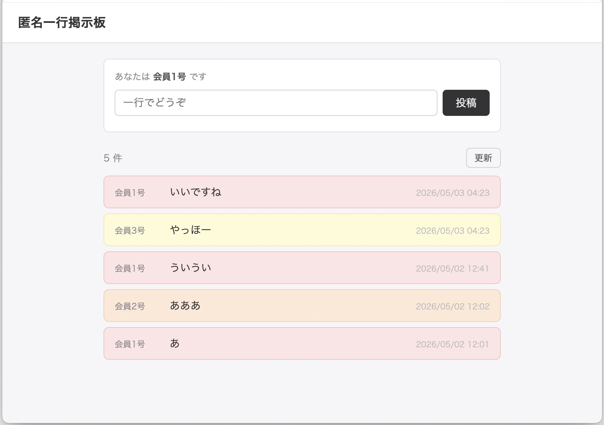
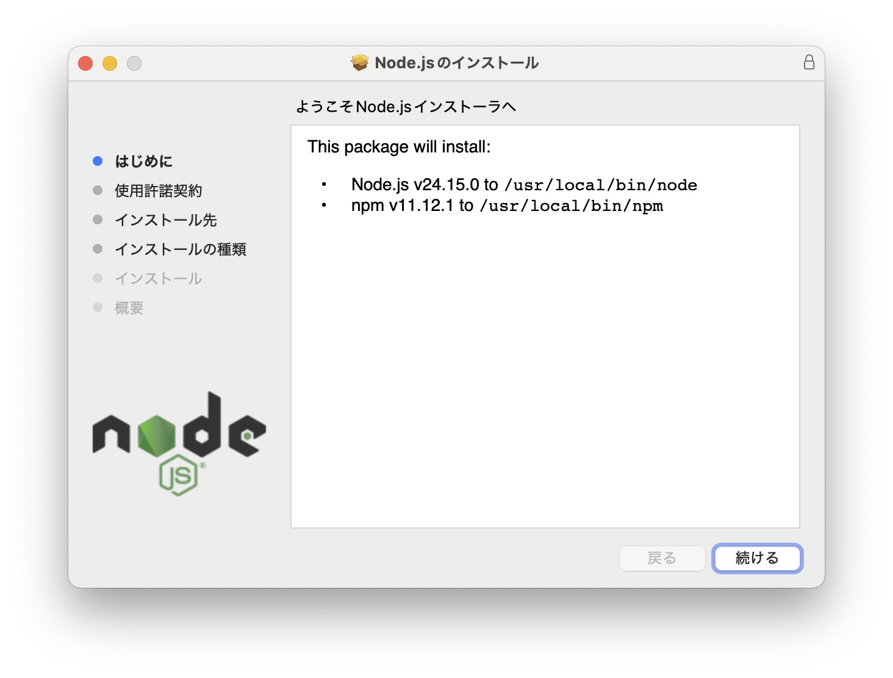
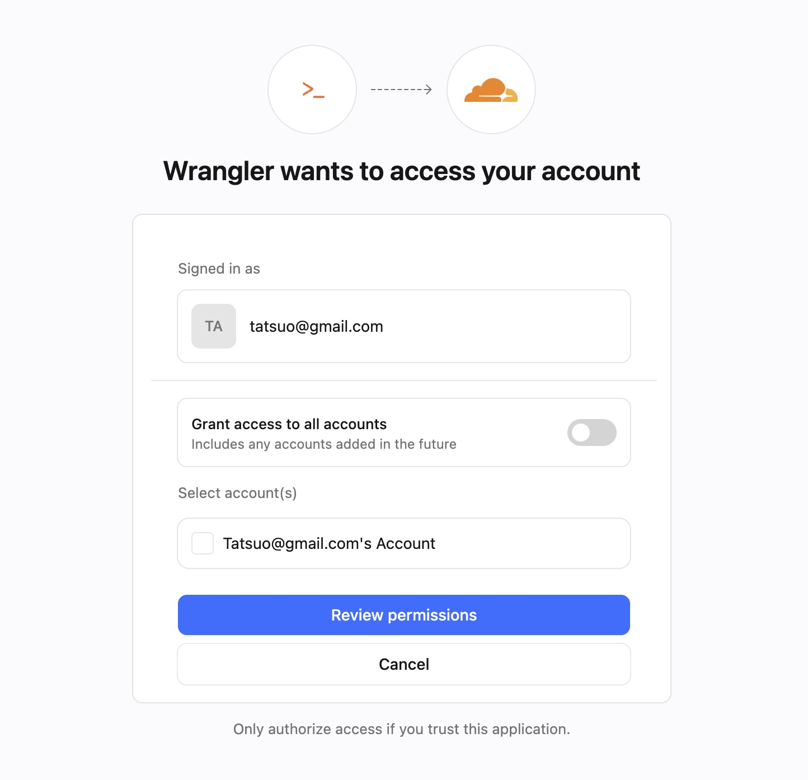

# Claude CodeでDB付きWebアプリを作ってCloudflareで公開するバイブコーディングハンズオン

<p class="subtitle">Cloudflare Pages + Pages Functions + D1 実践ガイド</p>

このハンズオンを始める前に、[Cloudflare構成ガイド](cloudflare-architecture-guide.html)を必ず読んでおいてください。また、[GitHub初心者ガイド](github-guide-first-step.html)も完了しておいてください。


## 1. このハンズオンで作るもの

Claude Codeで、DB付きのWebアプリをフルスタック開発してCloudflareで公開します。みんなが一緒に使えるアプリです。

### 匿名一行掲示板を作ります

このハンズオンではサンプルとして、**匿名一行掲示板**を作っていきます。   
仕様：

- 名前の入力不要。書き込むだけで投稿できます
- 書き込んだ人には自動的に「会員1号」「会員2号」と番号が割り振られます
- 同じブラウザから書き込むと、次回以降も同じ会員番号が使われます
- みんなの投稿を一覧表示します

<a href="images/cf-d1-bbs.jpg" target="_blank"></a>


### Claude Codeに丸投げせず、理解しながら進める

「Cloudflare Pages + D1で掲示板を作って」の一言でコードはほぼできます。シンプルなWebアプリならそれでも十分です。

ただ、DBやAPIが絡む少し複雑な構成になると、全体像の理解が重要になります。理由は2つ。

1つはClaude Codeに頼めない手作業があるからです。GitHubのSecrets登録など、ダッシュボード上の操作は自分でやる必要があります。何のためにこの設定をするかわかっていないと、トラブル時に困ります。

2つ目は次のアプリに活かせるからです。全体像を理解した上でClaude Codeと一緒にステップバイステップで進めると、構成のパターンが身につき、「次は〇〇を作りたい」となったときにも応用できます。

ということで、「Claude Codeに丸投げせず、理解しながら進める」がこのハンズオンの方針です。


---

## 2. 事前準備（初回のみ・ブラウザ操作）

### GitHubでリポジトリを作成

GitHub → New repository → リポジトリ名を入力して作成。**Private** を選ぶ（APIトークンなど意図しないファイルの公開を防ぐため）。

### CloudflareでAccount IDを確認

Cloudflareダッシュボード → Compute → **Workers & Pages** を開く。

- 右カラム、またはページ右側最下部に表示される **Account ID** をコピーしておく

### CloudflareでAPIトークンを作成

Cloudflare → 右上👤アイコン → Profile → API Tokens → Create Token → **Create Custom Token**

- Token name: これから作るWebアプリの名前など（例：`bbs001`）
- Permissions:

| リソース | 権限 |
|---|---|
| Account > Cloudflare Pages | Edit |
| Account > D1 | Edit |
| User > User Details | Read |

- Account Resource: **自分のアカウントのみ** に設定する。デフォルトの「All accounts」は不要なスコープを与えるため推奨しない

作成されたトークンをコピーしておく。

### GitHubにSecretsを登録

GitHubリポジトリ → Settings → Secrets and variables → Actions → **New repository secret**

| Secret名 | 値 |
|---|---|
| `CLOUDFLARE_API_TOKEN` | 上記で作成したトークン |
| `CLOUDFLARE_ACCOUNT_ID` | CloudflareのAccount ID |

---

## 3. Node.js のインストール

```bash
# インストール済みか確認
node -v
```

v22以上が表示されればOK（Homebrewなど他の方法で入れていても問題なし）。`command not found` またはv21以下の場合はインストールが必要。

[Node.js 公式サイト](https://nodejs.org)を開き、**LTS版** の **macOS 64-bit Installer**（`.pkg`ファイル）をダウンロードしてインストールする。インストール後に `npm` と `npx` も使えるようになる。

<a href="images/cf-d1-nodejs.jpg" target="_blank"></a>

> **LTS（Long Term Support）とは？** 「安定版」のこと。公式サイトに「LTS」と「最新/Current」の2種類があるが、LTS を選ぶのが定番。

---

## 4. wrangler のインストールとログイン

```bash
npm install -g wrangler
```

```bash
wrangler login
```

ブラウザが開いてCloudflareのOAuth認証画面が表示される。承認するとCLIから操作できるようになる。

<a href="images/cf-d1-cfoauth.jpg" target="_blank"></a>

---

## 5. wrangler.toml と package.json の作成
**サンプルプロンプト：**

```
以下のテンプレートで wrangler.toml を作成してください。
アプリ名は「○○」、データベース名は「○○」、YYYY-MM-DDは昨日、
database_id はあとで記入するので xxxxxx のままにしておいてください。

---
name = "アプリ名"
compatibility_date = "YYYY-MM-DD"
pages_build_output_dir = "."

[[d1_databases]]
binding = "DB"
database_name = "データベース名"
database_id = "xxxxxx"
migrations_dir = "migrations"
---
```

作成後、6章で `wrangler d1 create` を実行したら表示される `database_id` を Claude Code に伝えて書き換えてもらう。

```
wrangler.toml の database_id を「xxxxxxxx-xxxx-xxxx-xxxx-xxxxxxxxxxxx」に書き換えてください。
```

**package.json も作成する（`npm ci` に必要）：**

```
以下の内容で package.json を作成してください。
アプリ名は「○○」としてください。

---
{
  "name": "アプリ名",
  "private": true,
  "devDependencies": {
    "wrangler": "^4"
  }
}
---
```

package.json を作成したら、`npm install` を実行する。`package-lock.json` が生成される。Claude Code にpushを依頼すれば自動でコミットに含まれる。

```bash
npm install
```

`npm install` を実行すると `node_modules/` というフォルダが生成される。wranglerの実体が入っている大容量フォルダで、コミットは不要。Claude Code が自動で `.gitignore` に追加してくれることが多いが、念のため「.gitignore に node_modules/ を追加して」と依頼してもよい。

---

## 6. 【データベース】D1データベースを作成（初回のみ）

```bash
npx wrangler d1 create データベース名
# 表示された database_id を wrangler.toml に記入
```

> **Database IDについて** データベースの識別子です。仮に外部に漏れても、API Tokenがなければ操作できないため問題ありません。

---

## 7. 【データベース】スキーマ設計とマイグレーションファイル

Claude Code にアプリの仕様を伝えてテーブル設計を相談する。

**サンプルプロンプト（BBSの例）：**

```
匿名一行掲示板を作ります。仕様は以下のとおりです。

- 名前登録なし、初めて投稿したときに会員番号が払い出される（1, 2, 3...の連番）
- 同じブラウザから投稿した人には毎回同じ会員番号が使われるようにする
- 画面には「会員1号」「会員2号」と表示する
- 投稿内容は1行のテキスト

このアプリに必要なデータベースのテーブル設計を提案してください。
```

Claude Code がテーブル設計（スキーマ）を提案してくれる。疑問があれば質問しながら内容を確認しよう。

> **スキーマとは？** データベースの構造定義のことです。どんなテーブルがあり、それぞれどんな列（カラム）を持つかを定めたもので、建物で言えば「設計図」にあたります。

合意したら「このスキーマでマイグレーションファイルを作成して」と依頼すると
`migrations/0001_init.sql` を生成してくれる。

> **マイグレーションとは？** データベースの構造変更（テーブルの作成・変更・削除など）をSQLファイルとして管理する仕組みです。変更をファイルに記録しておくことで、「どの変更がいつ適用されたか」を追跡でき、本番環境への反映も自動化できます。

```
このスキーマでマイグレーションファイルを作成してください。
ファイルは migrations/0001_init.sql に保存してください。
```

スキーマ変更時は「〇〇カラムを追加して」と依頼すると
`migrations/0002_add_xxxx.sql` を作成してくれる。
push すれば自動で本番DBに適用。

---

## 8. 【バックエンド】Pages Functions（API）の作成
Claude Code にアプリの仕様とスキーマを伝えて「APIを作成して」と依頼すると
`functions/api/xxxx.js` を生成してくれる。

**サンプルプロンプト（BBSの例）：**

```
匿名一行掲示板のAPIを functions/api/posts.js に作成してください。
投稿の一覧取得と新規投稿ができるようにしてください。
D1 の binding 名は DB、スキーマは先ほど設計したものを使ってください。
```

DBを操作するAPIの実装は、業界標準的なパターンがほぼ決まっています。ここはClaude Codeにおまかせで問題ありません。

---

## 9. 【フロントエンド】フロントエンドの作成
DB定義・API定義を会話の中で共有した後に依頼すると、それを踏まえたUIを生成してくれる。

**サンプルプロンプト（BBSの例）：**

```
これまでのDB定義、API定義を参考に
匿名一行掲示板のフロントエンドを index.html として作成してください。
```

デザインの好みがあれば追加で伝えます：

```
シンプルで読みやすいデザインにしてください。
スマートフォンでも使いやすいようにしてください。
```

---

## 10. GitHub Actions ワークフローの作成

GitHub Actionsは、GitHubに組み込まれた自動化の仕組みです。「pushされたら〇〇を実行する」という処理をYAMLファイルに書いておくと、GitHubが自動で実行してくれます。この自動化の仕組みを**ワークフロー**と呼びます。このハンズオンでは `.github/workflows/deploy.yml` として作成します。

**サンプルプロンプト：**

````
以下のテンプレートで .github/workflows/deploy.yml を作成してください。
データベース名は「○○」、アプリ名は「○○」としてください。

---
name: Deploy to Cloudflare Pages

on:
  push:
    branches: [main]

jobs:
  deploy:
    runs-on: ubuntu-latest
    steps:
      - uses: actions/checkout@v4

      - uses: actions/setup-node@v4
        with:
          node-version: '22'

      - run: npm ci

      - name: Apply D1 migrations
        uses: cloudflare/wrangler-action@v3
        with:
          apiToken: ${{ secrets.CLOUDFLARE_API_TOKEN }}
          accountId: ${{ secrets.CLOUDFLARE_ACCOUNT_ID }}
          wranglerVersion: "4"
          command: d1 migrations apply データベース名 --remote

      - name: Create Pages project (初回のみ)
        continue-on-error: true
        uses: cloudflare/wrangler-action@v3
        with:
          apiToken: ${{ secrets.CLOUDFLARE_API_TOKEN }}
          accountId: ${{ secrets.CLOUDFLARE_ACCOUNT_ID }}
          wranglerVersion: "4"
          command: pages project create アプリ名 --production-branch=main

      - name: Deploy to Cloudflare Pages
        uses: cloudflare/wrangler-action@v3
        with:
          apiToken: ${{ secrets.CLOUDFLARE_API_TOKEN }}
          accountId: ${{ secrets.CLOUDFLARE_ACCOUNT_ID }}
          wranglerVersion: "4"
          command: pages deploy . --project-name=アプリ名
---
````

**ワークフローの流れ：**

pushをトリガーに、以下の順で実行されます。

1. **コードを取得**（actions/checkout） — GitHubのファイルをCI環境に展開する
2. **Node.jsをセットアップ**（actions/setup-node） — wranglerの実行に必要
3. **wranglerをインストール**（npm ci） — package.jsonに記載したwranglerをインストール
4. **D1マイグレーションを適用**（d1 migrations apply --remote） — 未適用のSQLファイルを本番DBに適用する
5. **Pagesプロジェクトを作成**（pages project create） — 初回のみ実行。2回目以降は失敗するが `continue-on-error: true` で無視される
6. **Pagesにデプロイ**（pages deploy） — フロントエンド・Pages Functionsを本番環境に反映する

各ステップでCloudflareの操作が必要なものは、GitHubのSecrets（`CLOUDFLARE_API_TOKEN`・`CLOUDFLARE_ACCOUNT_ID`）を使って認証します。

---

## 11. 初回デプロイ

```bash
git add .
git commit -m "initial"
git push -u origin main
```

GitHub Actions がワークフローにそって、セットアップ、マイグレーション、デプロイなどを自動実行。
Cloudflare Pages プロジェクトと D1 バインディングも自動作成される。

デプロイ完了後、`https://アプリ名.pages.dev` にアクセスして動作確認する。

---

## 12. 日常の開発フロー

```
Claude Code に依頼
  ├─ スキーマ変更 → migrations/000N_xxxx.sql を生成
  ├─ API 追加    → functions/api/*.js を生成
  └─ UI 変更     → index.html を更新

  → git push
  → GitHub Actions: マイグレーション（新ファイルのみ）→ デプロイ
```

push するだけで完結。手動のDB操作は不要。

ローカルで動作確認したい場合は「ローカルでプレビューを出してください」と Claude Code に依頼する。`wrangler pages dev .` が実行されてローカルサーバーが起動し、D1も含めたCloudflare環境を手元で確認できる。Claude Codeデスクトップアプリを使っている場合はアプリ内ブラウザで自動的にプレビューが表示される。

---

## 13. 備忘録

- `User > User Details: Read` 権限は wrangler がトークンの有効性を確認するために使う。なくても動くことがあるが、認証エラーの原因になる場合があるので残しておくのが無難
- `CLOUDFLARE_API_TOKEN` と `CLOUDFLARE_ACCOUNT_ID` の両方が必要（`d1 migrations apply --remote` がアカウントを明示的に要求するため。`pages deploy` だけなら `CLOUDFLARE_API_TOKEN` のみで可）
- `account_id` は wrangler.toml に書けない（Pages非対応）→ ワークフローで渡す
- wrangler はローカルインストールしてバージョン固定（Node.js 22以上が必要）
- ローカルで `wrangler d1 create` を使う前に `wrangler login` が必要（ブラウザ認証）
- スキーマ設計・マイグレーション・API・フロントエンドはすべて Claude Code に依頼
- D1バインディングは wrangler.toml の設定が `pages deploy` で自動反映
- Cloudflare PagesのGit連携は使わない（ダッシュボードから連携すると Deploy command が自動設定されてエラーになる。誤って連携した場合は Settings → Git repository → Disconnect git で切断）
- CIが自動でやるためダッシュボードでの手動操作は不要：Cloudflare Pages プロジェクトの作成・D1バインディング設定
- Cloudflare Pages プロジェクトの手動作成は不要（ワークフローの「Create Pages project」ステップが初回のみ自動で作成。2回目以降は失敗するが `continue-on-error: true` で無視される）
- `package.json`（`wrangler: "^4"` を devDependencies に含む）がないと `npm ci` が失敗する
- `package-lock.json` がないと `npm ci` が失敗する → package.json 作成後に `npm install` を実行してコミットに含める
- `wranglerVersion: "4"` を wrangler-action の各ステップに指定しないと古いバージョン（3.90.0 等）にフォールバックすることがある
- `compatibility_date` は UTC 基準なので JST の今日の日付は未来になる場合がある → 前日以前の日付を指定する

---

2026-05-02 (last updated: 2026-05-03)　タツヲ ([yto](https://x.com/yto))
