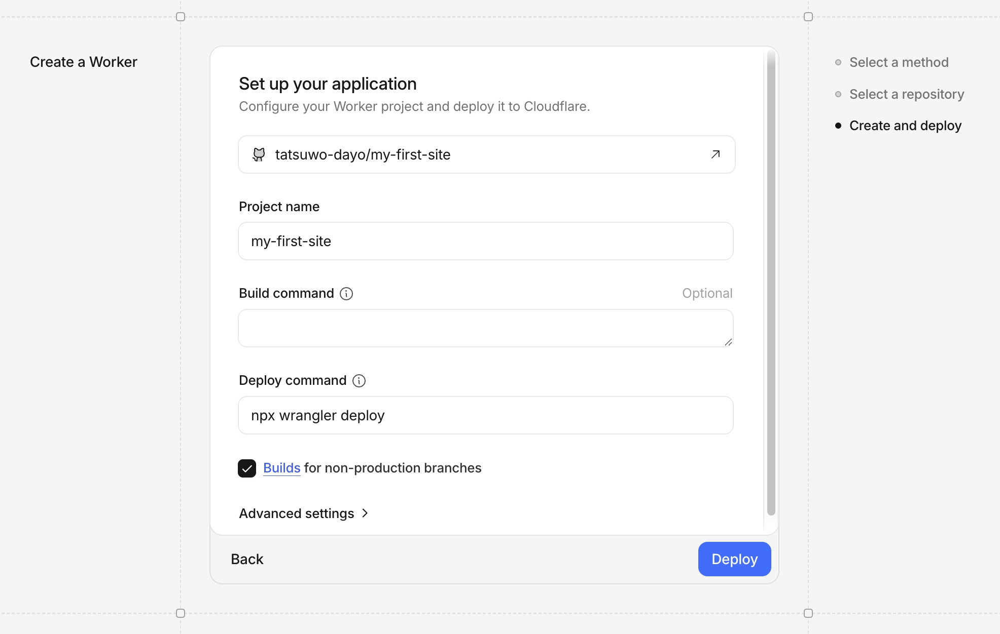
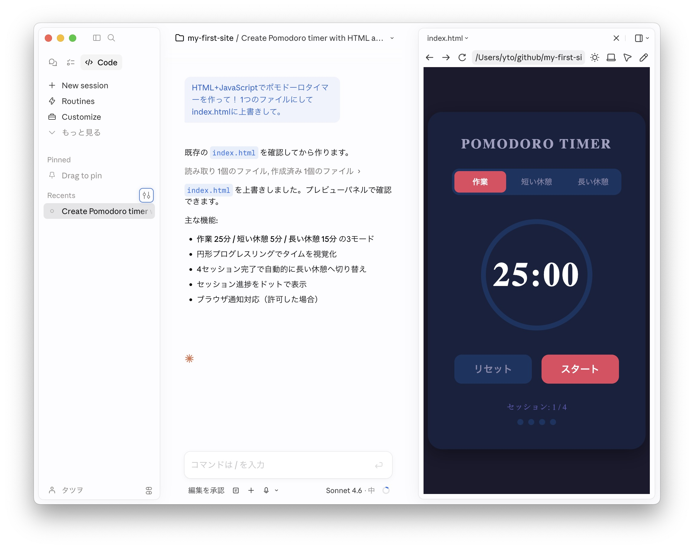
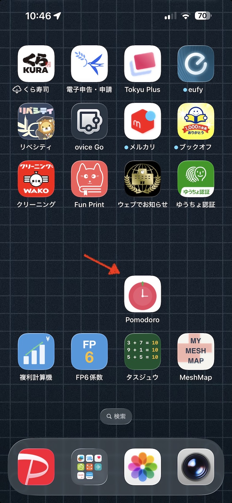

# Claude CodeでWebアプリを作ってGitHub連携でCloudflare Pagesに公開する

AIに話しかけてコードを作る「バイブコーディング」でWebアプリを作ります。  
そして、全世界に公開します。  
アカウント作成からWebアプリ公開まで一気にやりきるのが今回のハンズオンの目標です。

Webアプリとは、ブラウザで動くアプリのこと。インストール不要で、URLを開くだけで使えます。

Webアプリには大きく2つのタイプがあります。

- 一人完結型
  - データはブラウザ内（端末ごと）に保存されます。自分一人で使うのはもちろん、URLを共有すれば他の人も使えますが、お互いのデータは独立していて見えません。
  - 例：TODO、メモ帳、個人用ツール、オフライン対応アプリ
- 共有型
  - データはサーバーに保存されます。基本的にみんなで使う前提です。複数のユーザーや端末からアクセスでき、お互いのデータを共有・参照できます。
  - 例：SNS、チャット、共同編集、ランキング

違いは「データの本体がどこにあるか」で、この違いによって、アプリの作りやすさも大きく変わります。
一人完結型はシンプルに作れますが、共有型はデータ管理や通信処理が必要になり、構成が複雑になります。

今回のハンズオンでは、一人完結型（まずは自分一人が使うアプリ）を作ります。
シンプルな構成なので、ゼロから公開まで一気に進められます。

## 1. GitHub・Gitの準備

GitHubアカウントの作成、リポジトリの作成、Gitインストール、SSH設定、cloneまでは[GitHub初心者ガイド](github-guide-first-step.html)を参照のこと。

3章以降は以下の状態から進める。

- GitHubアカウント作成済み
- リポジトリ `my-first-site` 作成済み
- `~/Desktop/claude/my-first-site` に clone 済み

## 2. Cloudflare Pagesの設定

### 2-1. Cloudflareアカウントを作る

Cloudflareアカウントがなければ作る。
[こちらの手順](cloudflare-pages-static-files.html)を参照のこと。

### 2-2. Cloudflare PagesとGitHubを連携する

1. Cloudflareにログイン後、左メニューの **Compute** → **Workers & Pages** を選択
2. **Create application** をクリック
3. **Continue with GitHub** をクリック
4. GitHubの認証画面が開くので許可する
5. 連携するリポジトリを選択（`my-first-site`）して先へ進む

### 2-3. デプロイ設定をして初回デプロイ

**Set up your application** の画面が表示される。

<a href="images/cf-pages-3-cfsetup.jpg" target="_blank"></a>

以下のとおりに設定する。

| 項目 | 設定内容 |
|---|---|
| `Project name` | `my-first-site`（任意、URLの一部になる） |
| `Build command` | そのまま |
| `Deploy command` | `npx wrangler pages deploy .`（そのまま） |

**Deploy** をクリックすると初回デプロイが始まる。

### 2-4. 公開URLを確認する

デプロイ完了後、**Compute** → **Workers & Pages** → **my-first-site** で公開URLを確認する。
URLの形式は、`https://my-first-site（＝プロジェクト名）.アカウントID.workers.dev` である。

ブラウザでそのURLにアクセスし、GitHubのリポジトリにある `index.html` の内容が表示されているかを確認する。


## 3. Claude Code でWebアプリを作成

デスクトップ版Claudeアプリを起動。

**Code**（Claude Code）を選択 → **New session** をクリック → 作業ディレクトリを指定（`~/Desktop/claude/my-first-site`）

あとはプロンプトを入力して、`index.html` を編集する。

プロンプト例:
- `HTML+JavaScriptでポモドーロタイマーを作って！ 1つのファイルにしてindex.htmlに上書きして。`
- `複利計算機をHTML+JavaScriptで作って！ 構成はHTMLファイル(index.html)が1つ。`

右上のところからプレビューを選ぶと表示される（自動で表示されることも）。

<a href="images/claude-github-4-a.jpg" target="_blank"></a>

なお、途中いろいろ許可を求めてくるので対応する。


## 4. 作ったWebアプリをアップして公開する（デプロイ）

Claude Codeに依頼する：

```
変更をgitでコミットしてpushして（git push -u origin main で）
```

途中、操作の許可を求めてくることがあるので対応する。

GitHubへのpushを検知してCloudflare Pagesが自動でデプロイする。しばらく（1分以内）待ってから公開URLにアクセスして確認。

> Cloudflare Pagesのダッシュボードでデプロイの進行状況を確認できる。


## 5. Webアプリの修正と反映

修正依頼プロンプト例:
- `背景をもっと明るくしてください`
- `数値入力をスライダーにしてください`
- `ボタンの間隔をもっと広げて`
- 参考: [AIへの指示に使えるUI用語集 — 動く実例つき](https://yto.github.io/vibecoding/uiterms.html)

途中いろいろ許可を求めてくるので対応する。

納得したら、アップを依頼:

```
変更をgitでコミットしてpushして
```

しばらく待ってから公開URLにアクセスして確認。

このように修正と反映を繰り返して、Webアプリを仕上げよう！

## 6. その先のこと

### 6-1. PWA（スマホアプリのように使えるWebアプリ）にする

作ったWebアプリをPWA（Progressive Web App）にすると、スマートフォンのホーム画面に追加してネイティブアプリのように起動できるようになる。

<a href="images/claude-github-7-1-a.jpg" target="_blank"></a>

PWAの動作方式は色々あるが、たとえばこのような方式がおすすめ：

- アクセスするたびに新しいバージョンがあるか確認し、あれば自動更新
- ネットに繋がっていないときはキャッシュ（前回読み込んだデータ）を使って動作

`manifest.json` とService Workerのスクリプト（`sw.js` など）を追加するだけで実現できる。Claude Codeに相談してみよう。

```
このWebアプリをPWAにしたい。
アクセスのたびにバージョンチェックして更新し、オフラインはキャッシュで動くようにしたい。
```


### 6-2. みんなで使う（共有型）アプリを作る

チャットやランキング機能など、データを保存・共有するアプリを作る場合はサーバーやデータベースが必要。
Cloudflare Workers + D1（データベース）や、Vercel、Firebaseなどが選択肢となる。
GitHubでコードを管理するのは同じで、公開先をこれらのプラットフォームへ変える、というイメージ。
詳しくはClaude Codeに相談してみよう。   
（参考: [Cloudflare構成ガイド](cloudflare-architecture-guide.html)）

また、セキュリティ上の考慮が必要になることもあるため、GitHubのリポジトリは **Private** にしておくのが安心。


## 7. Tips

- GitHubへのアップを依頼するとき
  - 短めに `githubにアップ` `pushして` などでもokなことが多い
- 返答でファイル更新させない
  - 末尾に `アイディアください` `どうでしょうか` `考え聞かせて` などをつける
  - プランモードでも良いが切り替えが面倒
- バイブコーディングでWebアプリを作るときに便利な用語集
  - [AIへの指示に使えるUI用語集 — 動く実例つき](https://yto.github.io/vibecoding/uiterms.html)

---
2026-05-01 (last updated: 2026-05-04)　タツヲ ([yto](https://x.com/yto))
