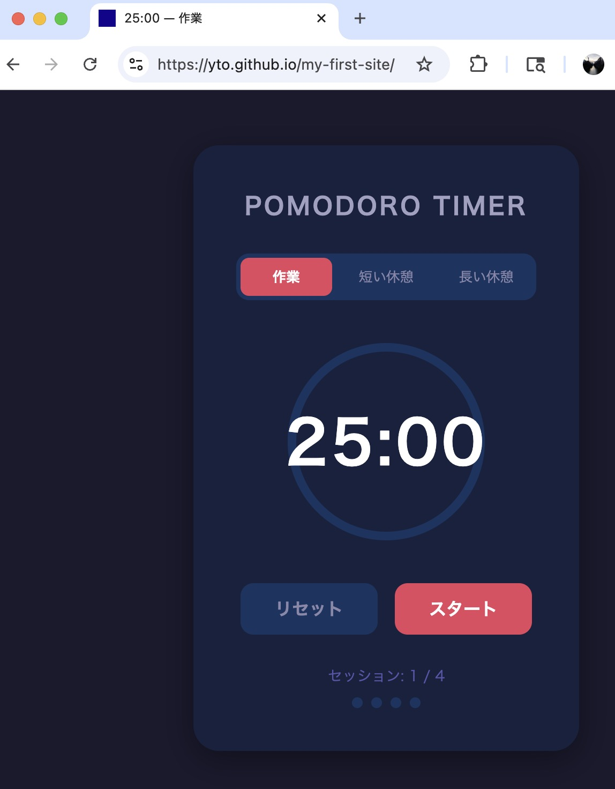
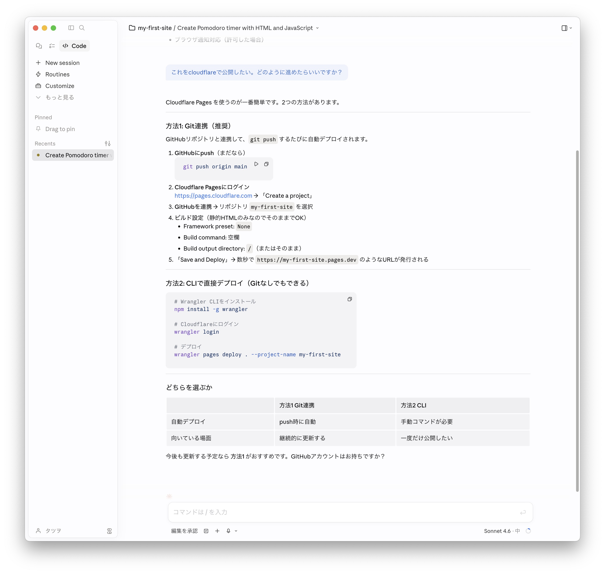
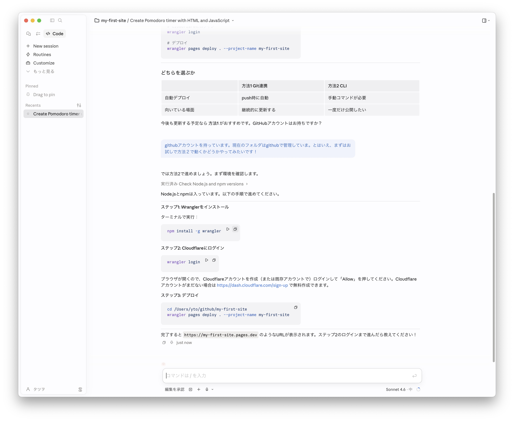
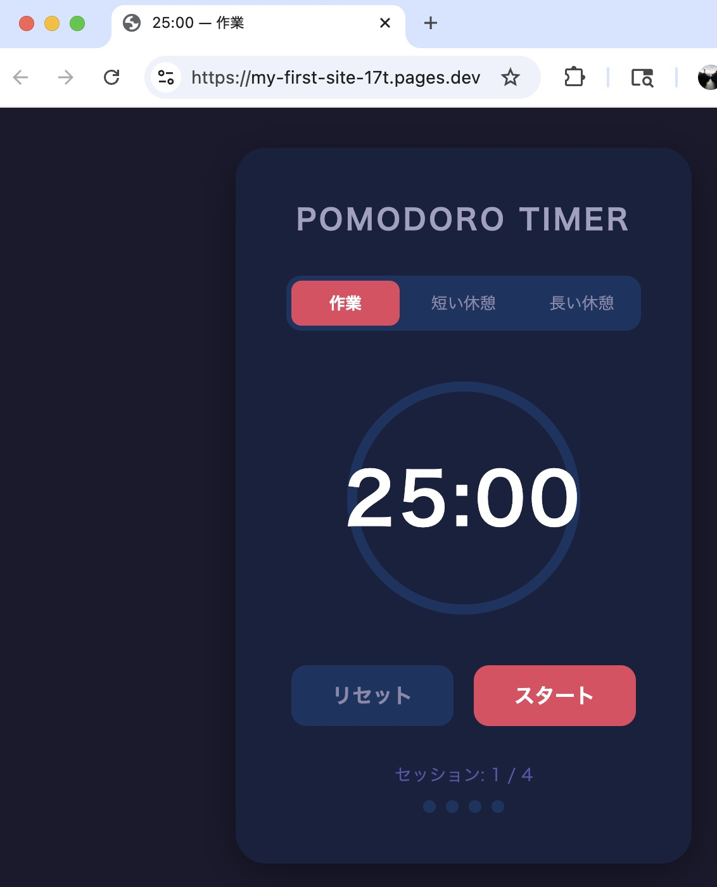

# Claude CodeでWebアプリを作ってgithub pagesで公開するバイブコーディングハンズオン

AIに話しかけてコードを作る「バイブコーディング」でWebアプリを作ります。  
そして、全世界に公開します。  
アカウント作成からWebアプリ公開まで一気にやりきるのが今回のハンズオンの目標です。

Webアプリとは、ブラウザで動くアプリのこと。インストール不要で、URLを開くだけで使えます。

Webアプリには大きく2つのタイプがあります。

- ブラウザ保存型
  - データはブラウザ内（端末ごと）に保存されます。自分一人で使うのはもちろん、URLを共有すれば他の人も使えますが、お互いのデータは独立していて見えません。
  - 例：TODO、メモ帳、個人用ツール、オフライン対応アプリ
- サーバー保存型
  - データはサーバーに保存されます。基本的にみんなで使う前提です。複数のユーザーや端末からアクセスでき、お互いのデータを共有・参照できます。
  - 例：SNS、チャット、共同編集、ランキング

違いは「データの本体がどこにあるか」で、この違いによって、アプリの作りやすさも大きく変わります。
ブラウザ保存型はシンプルに作れますが、サーバー保存型はデータ管理や通信処理が必要になり、構成が複雑になります。

今回のハンズオンでは、ブラウザ保存型（まずは自分一人が使うアプリ）を作ります。
シンプルな構成なので、ゼロから公開まで一気に進められます。

## 1. 必要なもの（必須）

- マシン
  - macosが動くPC（macbookなど）
- アプリ（mac）
  - chrome
  - Claude Desktop
- アカウント
  - google アカウント（会場で見られてもよいアカウント名のもの）
  - Claude の有料プラン（Claude Pro でOK）

## 2. GitHub・Gitの準備

GitHubアカウントの作成、リポジトリの作成、Gitインストール、SSH設定、cloneまでは **[GitHub初心者ガイド](github-guide-first-step.html)** を参照してください。

3章以降は以下の状態から進めます。

- GitHubアカウント作成済み
- リポジトリ `my-first-site` 作成済み（Public、GitHub Pages 有効）
- `~/Desktop/claude/my-first-site` に clone 済み

## 3. Claude Code でWebアプリを作成

デスクトップ版Claudeアプリを起動。

「Code」(Claude Code) を選択 → 「New session」をクリック → 作業ディレクトリを指定 (`~/Desktop/claude/my-first-site`)

あとはプロンプトを入力して、index.htmlを編集する。

プロンプト例:
- `HTML+JavaScriptでポモドーロタイマーを作って！ 1つのファイルにしてindex.htmlに上書きして。`
- `複利計算機をHTML+JavaScriptで作って！ 構成はHTMLファイル(index.html)が1つ。`

右上のところからプレビューを選ぶと表示される（自動で表示されることも）。

<a href="images/claude-github-4-a.jpg" target="_blank"></a>

なお、途中いろいろ許可を求めてくるので対応する。

## 4. 作ったWebアプリをgithubにアップして公開する（デプロイ）

ターミナルに戻って以下を順番に実行。
```
git status
git add .
git commit -m "update"
git push
```

`git status` で今どんな状態か確認してから進めると安全。

しばらく（1分くらい）待ってから公開URLにアクセスして確認。

公開URL: `https://ユーザー名.github.io/my-first-site/`

<a href="images/claude-github-5-a.jpg" target="_blank"></a>

## 5. Webアプリの修正と反映

修正依頼プロンプト例:
- `背景をもっと明るくしてください`
- `数値入力をスライダーにしてください`
- `ボタンの間隔をもっと広げて`
- 参考: [AIへの指示に使えるUI用語集 — 動く実例つき](https://yto.github.io/vibecoding/uiterms.html)

途中いろいろ許可を求めてくるので対応する。

納得したら、githubへのアップを依頼: `変更をgitでコミットしてpushして`

しばらく（1分くらい）待ってから公開URLにアクセスして確認。

このように修正と反映を繰り返して、Webアプリを仕上げよう！

## 6. その先のこと

### 6-1. PWA（スマホアプリのように使えるWebアプリ）にする

作ったWebアプリをPWA（Progressive Web App）にすると、スマートフォンのホーム画面に追加してネイティブアプリのように起動できるようになる。

<a href="images/claude-github-7-1-a.jpg" target="_blank"></a>

PWAの動作方式は色々あるが、たとえばこんな方式にできる：

- アクセスするたびに新しいバージョンがあるか確認し、あれば自動更新
- ネットに繋がっていないときはキャッシュ（前回読み込んだデータ）を使って動作

「manifest.json」と「Service Worker」というファイルを追加するだけで実現できる。Claude Codeに `このWebアプリをPWAにしたい。アクセスのたびにバージョンチェックして更新し、オフラインはキャッシュで動くようにしたい。` と相談してみよう。

### 6-2. リポジトリをPrivateにしたい

今回のハンズオンではリポジトリをPublic（公開）に設定しているため、ファイルの中身や変更履歴は誰でも閲覧できる状態になっている。
HTML + JavaScript + CSSだけのシンプルなアプリであれば大きな問題になることは少ないが、以下のようなケースではPrivate（非公開）に変更するのがおすすめ。
- 試行錯誤の履歴を見られたくない
- 意図しないファイルを公開してしまうリスクを避けたい

変更方法：リポジトリの `Settings` → `Danger Zone`（ページ下部） → `Change repository visibility`

ただし、GitHub Free（無料版）のPrivateリポジトリではGitHub Pagesは使えない。PrivateのままGitHub Pagesを使うにはGitHub Pro以上が必要。  
無料のまま非公開で運用したい場合は、Cloudflare Pagesなど別のホスティングサービスが選択肢となる。
詳しくはClaude Codeに相談してみよう。

### 6-3. Cloudflare Pages で公開する

`これをcloudflareで公開したい。どのように進めたらいいですか？` とClaude Codeに相談してすすめたログ。

<a href="images/claude-github-7-3-a.jpg" target="_blank"></a>

<a href="images/claude-github-7-3-b.jpg" target="_blank"></a>

<a href="images/claude-github-7-3-c.jpg" target="_blank"></a>


### 6-4. みんなで使う（サーバー連携型）アプリを作る

チャットやランキング機能など、データを保存・共有するアプリを作る場合はサーバーやデータベースが必要。
Cloudflare、Vercel、Firebaseなどのフルスタック開発プラットフォームが選択肢となる。
GitHubでコードを管理するのは同じで、公開先（ホスティング先）をGitHub Pagesからこれらのプラットフォームへ変える、というイメージ。
詳しくはClaude Codeに相談してみよう。   

また、セキュリティ上の考慮が必要になることもあるため、GitHubのリポジトリはPrivateにしておくのが安心。

## 7. 用語

### 基本用語

- Git
  - ファイルの変更履歴を記録・管理する仕組み
  - あくまで「仕組み（ツール）」であってサービスではない
  - Gitで管理するデータを置いて共有するサービスの一つがGitHub
  - 変更履歴はスナップショットやセーブポイント（ゲームの）みたいな感じで保存される
  - コマンド:
    - `git clone git@github.com:ユーザー名/my-first-site.git` — リモート（今回はGitHub）にあるリポジトリを自分のPCにコピーしてくる
    - `git add .` — セーブポイントに含めるファイルを選ぶ。`.` は「全部」という意味
    - `git commit -m "update"` — 変更内容のセーブポイントを作る。`-m` の後に何を変えたかのメモを書く
    - `git push` — 作ったセーブポイントをリモートにアップロードする
- GitHub
  - 履歴が残って、みんなで編集できて、そのまま公開もできるクラウドフォルダ
    - 参考: [GitHub初心者ガイド](github-guide-first-step.html)
- バイブコーディング (vibe coding)
  - 雰囲気（バイブ）でAIに指示して作らせる開発スタイル

### Tips

- GitHubへのアップを依頼するとき
  - 短めに `githubにアップ` で
- 返答でファイル更新させない
  - 末尾に `アイディアください` `どうでしょうか` `考え聞かせて` などをつける
  - プランモードでも良いが切り替えが面倒
- バイブコーディングでWebアプリを作るときに便利な用語集
  - [AIへの指示に使えるUI用語集 — 動く実例つき](https://yto.github.io/vibecoding/uiterms.html)

---
2026-04-20 タツヲ ([yto](https://x.com/yto))
