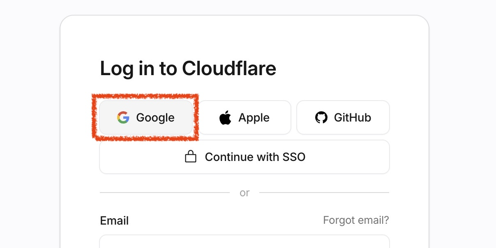
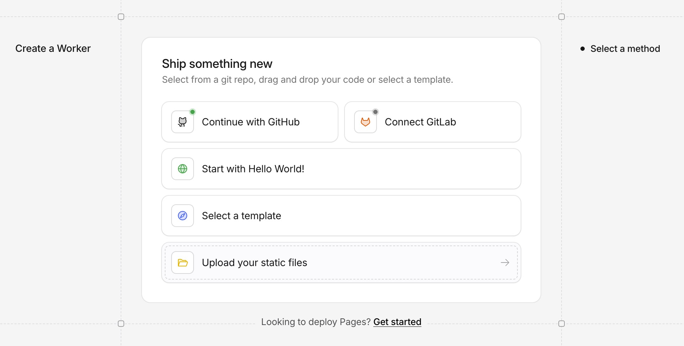
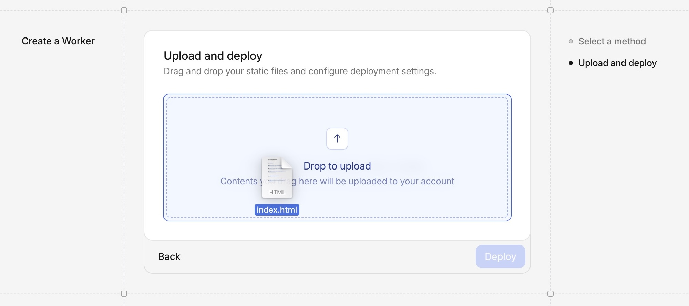
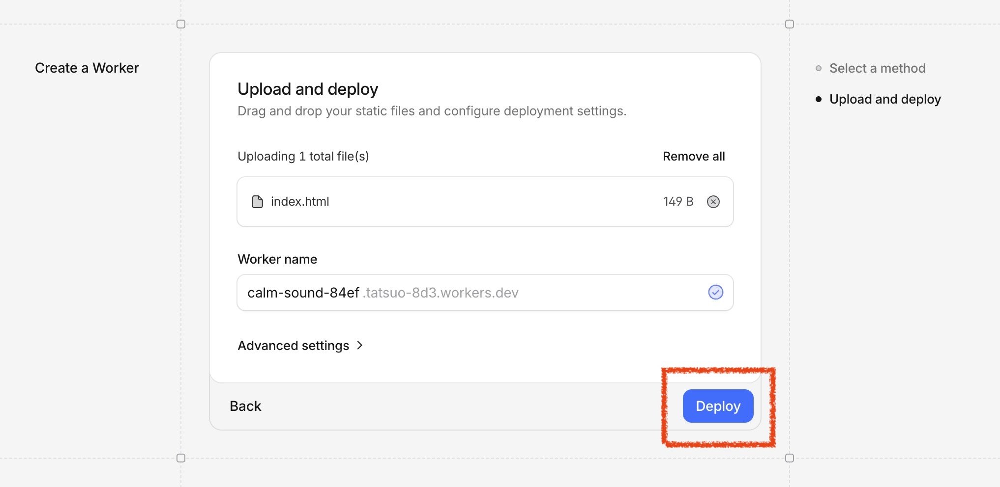
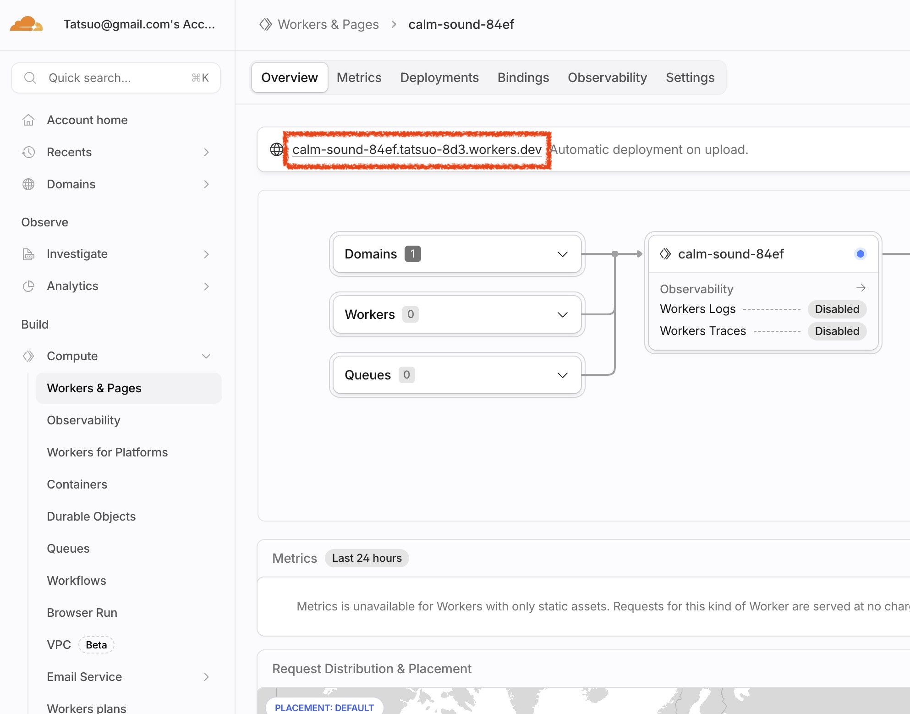

# Cloudflare Pagesで静的ファイルをアップロードしてWebページとして公開する

Cloudflare PagesでHTML・CSS・JavaScriptなどの静的ファイルをそのままアップロードして簡易デプロイする。

## 1. Cloudflare PagesにWebページをサクッと公開する

<a href="images/cf-pages-3-cftop.jpg" target="_blank"></a>

### 1-1. Cloudflareアカウントを作る

- [Cloudflareのサイト](https://www.cloudflare.com/ja-jp/)にアクセスして **無料で始める** をクリック、または右上の **ログイン** → **Sign up**
- Googleアカウントがあればそれでサインアップすると楽

<a href="images/cf-pages-3-signup.jpg" target="_blank"></a>

### 1-2. アップするファイルを準備する

- Finderでデスクトップに作業用フォルダ（例えば "cf"）を作成する。
- そこに新規ファイル `index.html` を作る。
- `index.html` をテキストエディタで開く
  - 例えば、`index.html` を二本指タップ（右クリック）して、**このアプリケーションで開く** → **テキストエディット**
- 下記を貼り付けて保存する
```html
<!DOCTYPE html>
<html lang="ja">
<head>
  <meta charset="UTF-8">
  <title>My First Page</title>
</head>
<body>
  <p>Hello World!</p>
</body>
</html>
```

### 1-3. Cloudflare Pagesにアップロードしてデプロイ

- Cloudflareのダッシュボードの左メニューの **Compute** → **Workers & Pages** をクリック
- 右上にある **Create application** をクリック
- **Upload your static files** をクリック

<a href="images/cf-static-ship.jpg" target="_blank"></a>

- **Drag in or click to upload a file or folder** と書かれたエリアに、さっき作った `index.html` をドラッグ＆ドロップする

<a href="images/cf-static-dd.jpg" target="_blank"></a>

- **Deploy** をクリックする

<a href="images/cf-static-deploy.jpg" target="_blank"></a>

- デプロイが終わるとプロジェクトページになる。上部に公開URLが出ている。URLの形式は、`https://プロジェクト名.アカウントID.workers.dev` である。

<a href="images/cf-static-kanri.jpg" target="_blank"></a>

- そのページに行ってみると、`Hello World!` と表示されているのが確認できる

なお、ファイルだけでなく、フォルダごとアップロードもできる。
画像ファイルもアップできるのでウェブサイトがまるっとホスティングできる。

サイトを更新するには:

- プロジェクトページの右上の **New deployment** ボタンをクリック
- アップロードのページが開くのでまたそこにドラッグ＆ドロップ
- **Deploy** をクリックすれば完了

更新時の注意:

- これまでのファイルは消えて、新たにアップロードしたものが入る
- 過去のものにロールバックはできる（プロジェクトページのタブ **Deployments** をクリック）


## 2. 【発展編】Claude Code で簡単なWebアプリを作成してサクッと公開する

**必要なもの:** Claude Desktop アプリ, Claude の有料プラン（Claude Pro でOK）

デスクトップ版Claudeアプリを起動。

**Code**（Claude Code）を選択 → **New session** をクリック → 作業ディレクトリを指定（`~/Desktop/cf`）

あとはプロンプトを入力して、`index.html` を編集する。

プロンプト例:
- `HTML+JavaScriptでポモドーロタイマーを作って！ 1つのファイルにしてindex.htmlに上書きして。`
- `複利計算機をHTML+JavaScriptで作って！ 構成はHTMLファイル(index.html)が1つ。`

<a href="images/cf-static-app.jpg" target="_blank"></a>

なお、途中でファイル操作の許可を求められることがあるので、その都度許可する。

完成した `index.html` を「1-3. Cloudflare Pagesにアップロードしてデプロイ」の手順でデプロイして、公開URLを確認する。

<a href="images/cf-static-cc.jpg" target="_blank"></a>


## 3. 次のステップ

このハンズオンでは、静的ファイルを手動でアップロードしてデプロイする方法を学んだ。さらに進みたい場合は以下を参考に。

- [GitHub初心者ガイド](github-guide-first-step.html) — コードをGitHubで管理する方法を学ぶ。バージョン管理の基本から始めたい人向け。
- [Claude CodeでWebアプリを作ってCloudflare Pagesで公開するバイブコーディングハンズオン](claude-code-web-app-cloudflare-pages.html) — GitHubと連携した本格的なデプロイフローにステップアップ。

---
2026-05-04 (last updated: 2026-05-05)　タツヲ ([yto](https://x.com/yto))
