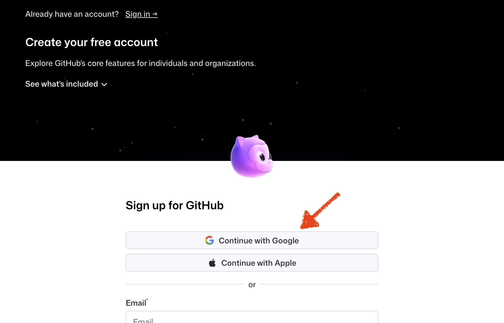
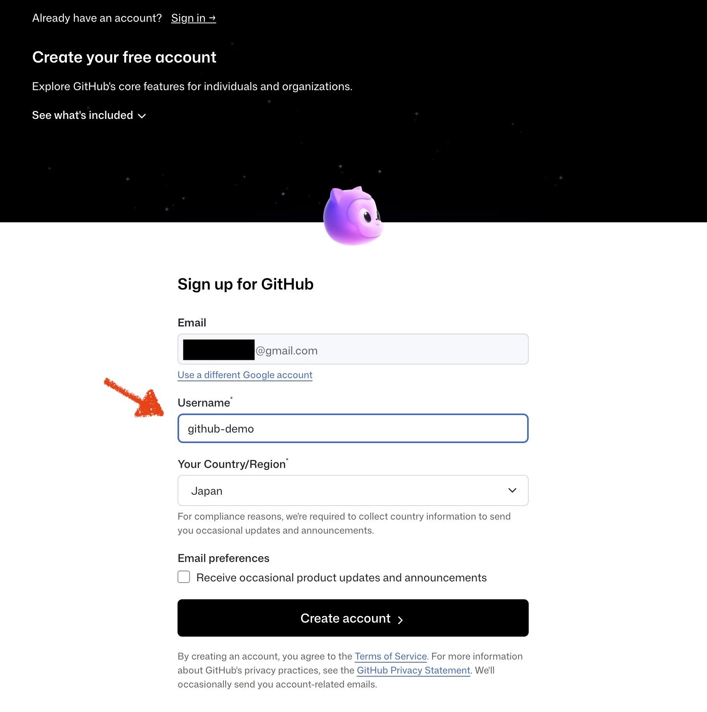
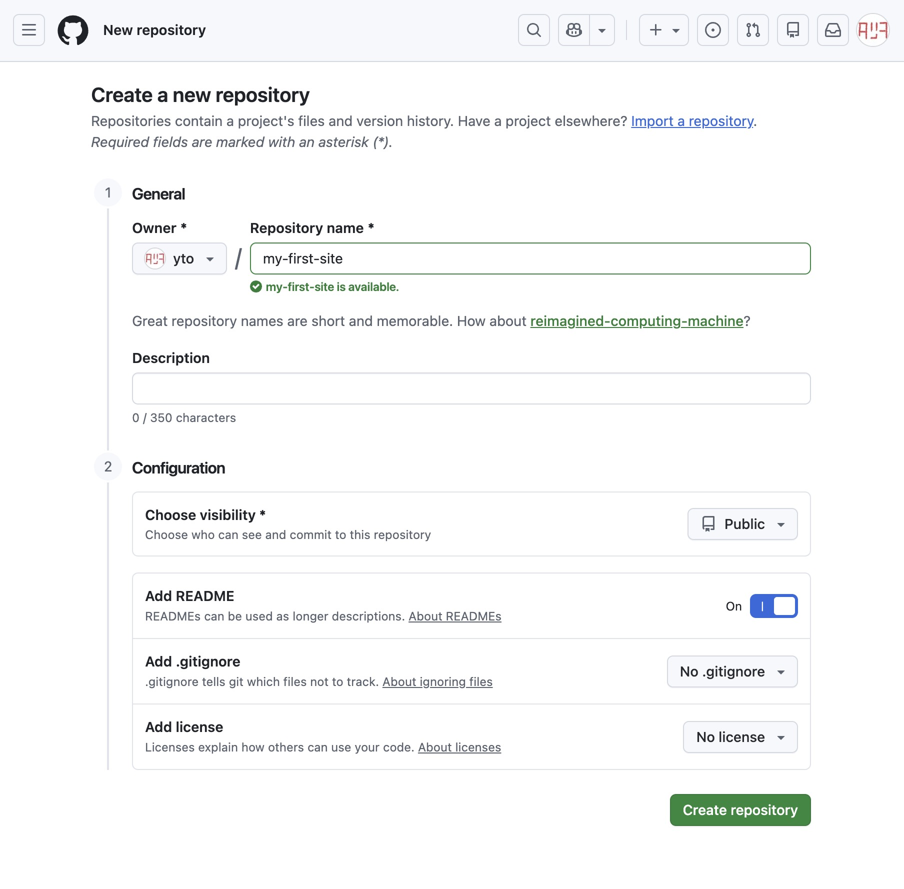
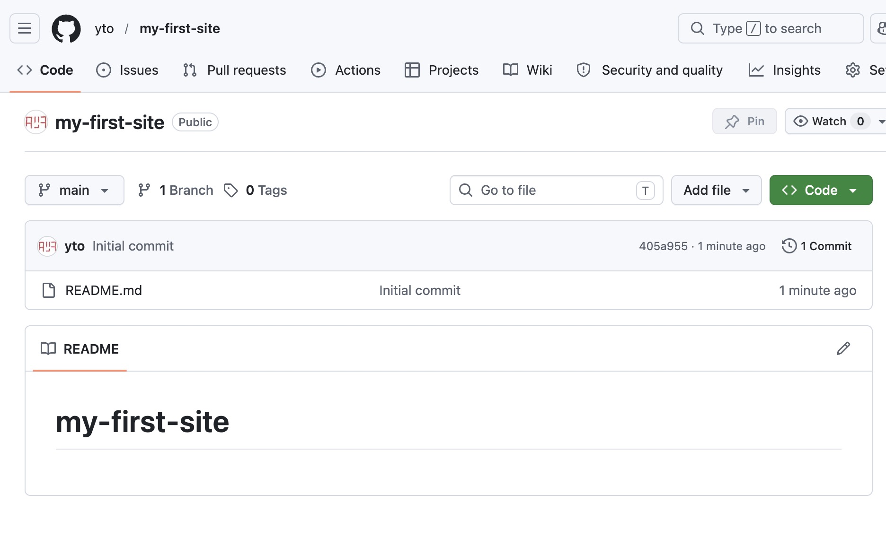
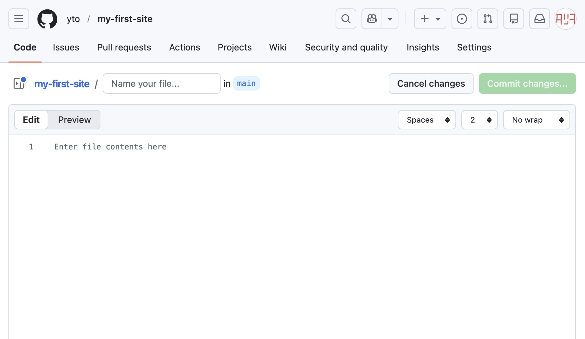
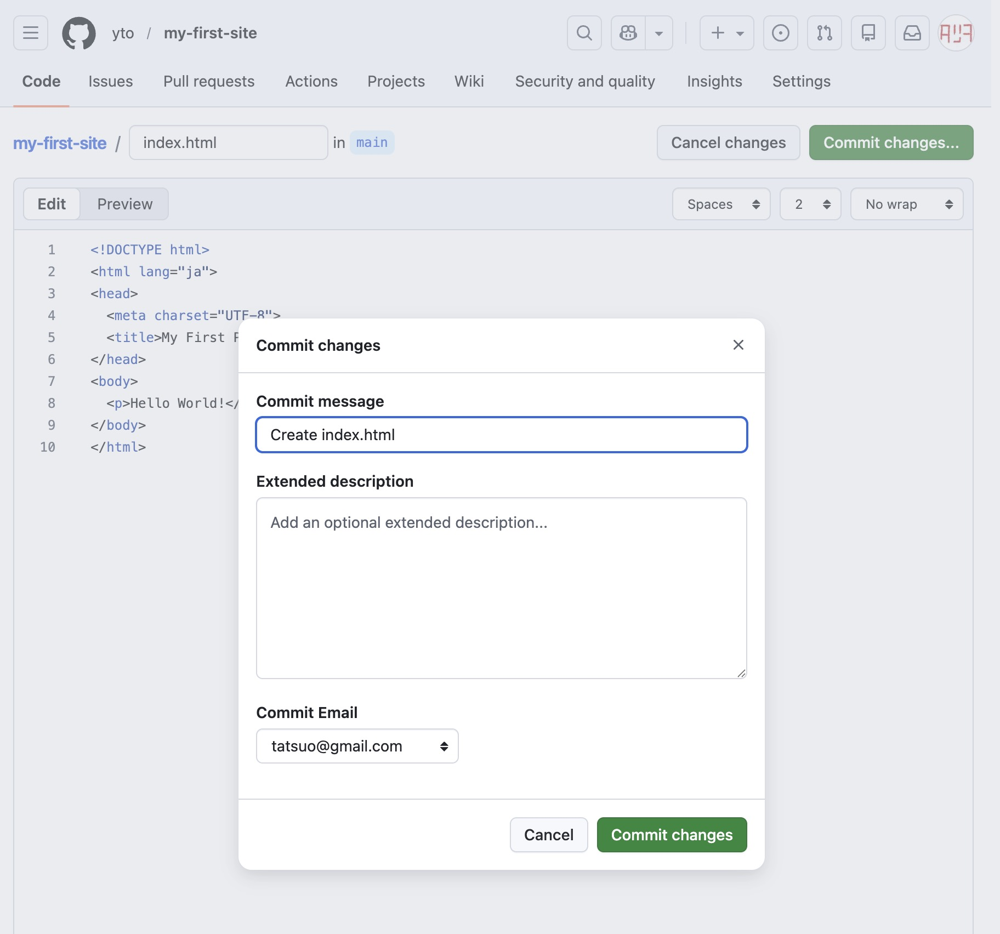
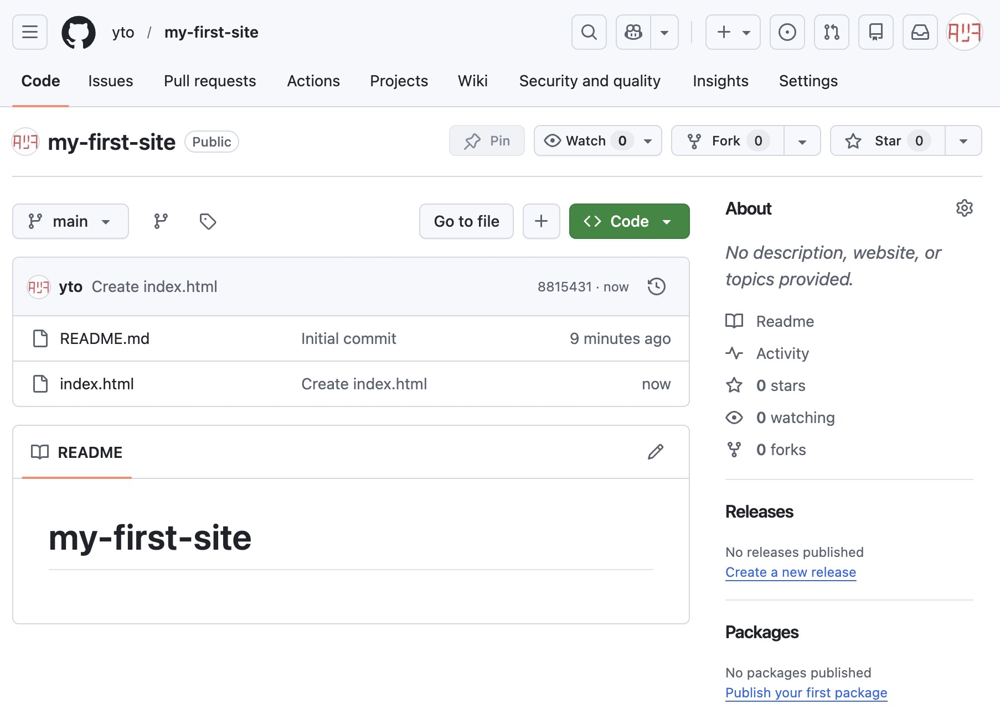
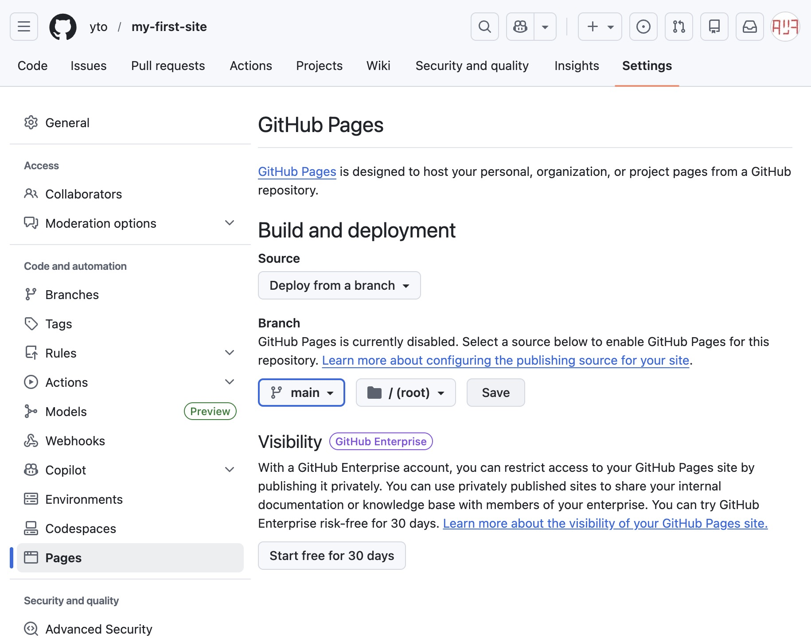
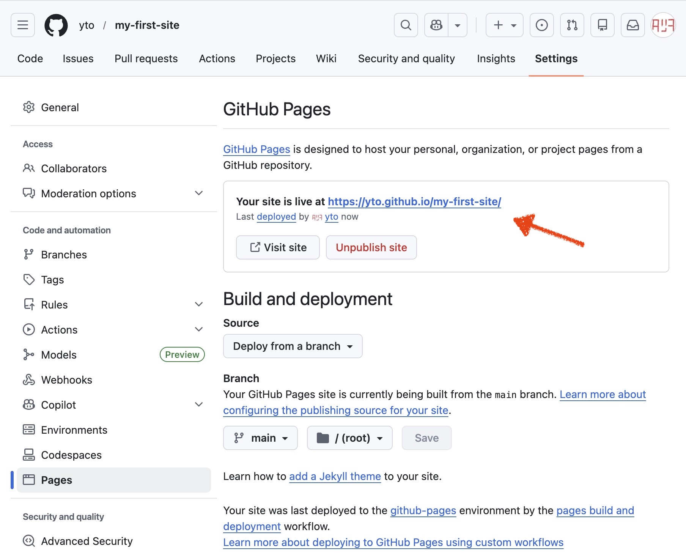
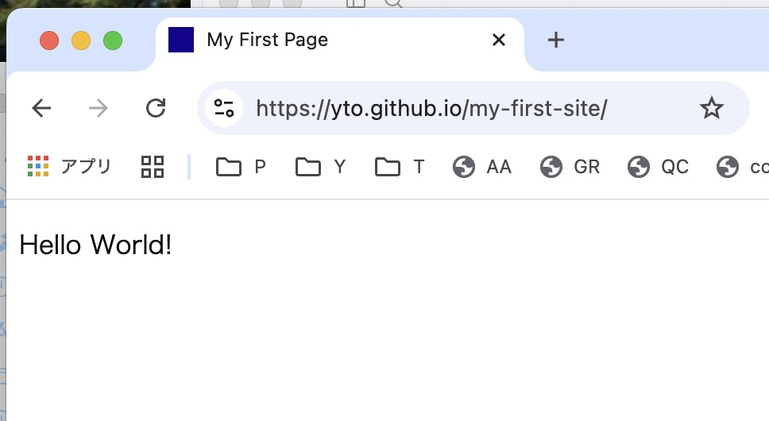

# GitHub初心者ガイド

技術的に厳密でない部分もありますが、わかりやすさ優先で解説します。

**前提** Mac（MacBookなど）、Googleアカウント

---

## 1. GitHubとは

GitHubは「変更履歴ごと保存できるネット上のフォルダ」のようなもの。

Macのデスクトップに「確定申告」「旅行写真」「ブログネタ」など用途別フォルダを作るように、GitHub上でもタスクごとに専用フォルダ（= **リポジトリ**）を作って管理する。

### 1-1. GitとGitHubの関係

よく混同されるが、GitとGitHubは別のもの。

**Git** はMacの中で動く変更管理ツール。ファイルの変更履歴をローカルで記録する仕組みで、インターネットがなくても使える。無料のオープンソースソフトウェアで、Macには最初から入っているか、簡単にインストールできる。

**GitHub** はその記録を置いておくクラウドサービス。Gitで管理した履歴をネット上にアップロードして保存したり、他の人と共有したりできる。Microsoftが運営している。類似のサービスにGitLabやBitbucketなどがある。

「GitがツールでGitHubはサービス」という関係。Gitだけでも使えるが、GitHubと組み合わせることでバックアップや共同作業が可能になる。

### 1-2. ローカルとリモート

GitとGitHubを使うとき、ファイルは2拠点で管理される。

- **ローカル**：自分のMacの中。ここで実際にファイルを編集する
- **リモート**：GitHubのサーバー上。ローカルの記録をアップして保存しておく場所

```
ローカル（Mac）  ←→  リモート（GitHub）
```

基本の流れは、ローカルで作業してリモートに送ること（**push**）。逆にリモートの最新状態をローカルに取り込むことを **pull** という。初回だけはリモートのリポジトリをMacに丸ごとコピーする操作（**clone**）から始める。コマンドの詳細は3章で説明する。

### 1-3. 変更履歴をすべて記録する

GitHubの中心にあるのは「変更の記録」という考え方。ファイルを変えるたびに「いつ・何を・どう変えたか」が蓄積されていく。

`backup_20240401.zip` のようにファイルを丸ごとコピーして取っておく管理と違い、「いつの状態に戻したいか」を名前で指定できる。どのバックアップが何の目的で作られたものか、何を変えた時点のものかが一目でわかる。過去の任意の時点の状態にいつでも戻せるし、「どこで壊れたか」をさかのぼって確認することもできる。

ゲームのセーブポイントのイメージに近い。「ここまでは確実に動いている」という状態を何度でも記録しておいて、何かあれば戻れる。

### 1-4. チームでも一人でも、複数の環境で使える

複数人が同じプロジェクトを触るとき、GitHubは「誰が・いつ・何を変えたか」を把握しながら作業を進める仕組みを提供する。エンジニアの開発現場では、AさんとBさんが同じコードを同時に編集することが日常的にある。GitHubでは**ブランチ**（作業用のコピー）を使って並行作業し、確認できたら本体に合流させる流れが基本。変更のレビューや承認もGitHub上で完結する。

一人で開発する場合でも、自宅のMac miniと持ち歩きのMacBookを使い分けているような状況では同じ仕組みが役立つ。GitHubをハブにして「どちらのMacでも常に最新の状態を pull して作業する」という使い方をすれば、環境の違いを意識せずに続きから作業できる。複数台のMacは、チームにおける複数人と構造的に同じ状況。

### 1-5. エンジニア以外にも使われている

コードを書く人のためのツールというイメージが強いが、テキストを扱う作業全般に使われている。

- **Webデザイナー**：HTMLやCSSのバージョン管理。「デザインを変えたら崩れた」を前の状態に戻せる
- **文章執筆**：Markdownで原稿を管理。変更箇所の差分がひと目でわかるため、修正履歴の確認が楽
- **設定ファイル管理**：MacのアプリやTerminalの設定ファイルをGitHubで管理しておくと、新しいMacへの移行が楽になる

「テキストベースのファイルであれば何でも」という感覚で使える。

### 1-6. ファイル管理以外にできること

**GitHub Pages**  
リポジトリに置いたHTMLファイルをそのままWebサイトとして無料で公開できる機能。レンタルサーバーを契約しなくても、URLが発行されて誰でもアクセスできる状態になる。ポートフォリオ、ドキュメントサイト、静的なブログなどに広く使われている。実際の手順は2章で説明する。

**GitHub Actions**  
pushやmergeをきっかけに、自動でスクリプトを動かす仕組み。「変更をpushしたら自動でサイトをビルドしてデプロイ」「毎朝決まった時間に外部データを取得してリポジトリに保存」といったことができる。最初は使わなくてよいが、こういう仕組みが標準で用意されていることは覚えておくと良い。

## 2. Webブラウザだけで登録・作成・公開する

この章はターミナル不要。ブラウザだけでアカウント登録からWebサイト公開まで行う。

### 2-1. GitHubアカウントを作る

1. [github.com](https://github.com) にアクセスして `Sign up for GitHub` をクリック   
<a href="images/github-guide-2-1-a.jpg" target="_blank"></a>

2. Googleアカウントで登録する場合は `Continue with Google` を選択   
<a href="images/github-guide-2-1-b.jpg" target="_blank"></a>

3. ユーザー名を設定して登録完了   
<a href="images/github-guide-2-1-c.jpg" target="_blank"></a>

> ユーザー名はURLに使われる（`github.com/ユーザー名`）。後から変更できるが、外部に共有したURLが変わってしまうので最初から決めておくと良い。

### 2-2. リポジトリを作る

ログイン後、右上の `+` ボタン → `New repository` をクリック。

| 項目 | 設定内容 |
|---|---|
| Repository name | `my-first-site` にしてください |
| Description | 任意（空でもOK） |
| Choose visibility | 初心者は基本的に **Private（非公開）** を選ぶ。GitHub Pages を使う場合は **Public（公開）** を選ぶ。あとから変更することも可能。詳しくは「[リポジトリをPrivateにする](#private)」を参照 |
| Add README | **チェックを入れる**（リポジトリの概要を書くファイル。リポジトリのトップページに自動表示される） |

<a href="images/github-guide-2-2-a.jpg" target="_blank"></a>

`Create repository` ボタンを押せばリポジトリ完成。

<a href="images/github-guide-2-2-b.jpg" target="_blank"></a>

### 2-3. リポジトリにファイルを追加してみる

リポジトリのトップページで `Add file` → `Create new file` をクリック（画面幅が狭い場合は `Add file` の代わりに `+` と表示される）。

<a href="images/github-guide-2-3-a.jpg" target="_blank"></a>

1. ファイル名の入力欄に `index.html` と入力
2. エディタ部分に以下を貼り付ける   
```html
<!DOCTYPE html>
<html lang="ja">
<head>
  <meta charset="UTF-8">
  <title>My First Page</title>
</head>
<body>
  <p>Hello World!</p>
</body>
</html>
```

3. 右上の `Commit changes...` ボタンをクリック
4. コミットメッセージ（例：「最初のページを追加」／空でもよい）を入力して `Commit changes`   
<a href="images/github-guide-2-3-b.jpg" target="_blank"></a>

リポジトリのトップページに `index.html` が表示されていれば完了。

<a href="images/github-guide-2-3-c.jpg" target="_blank"></a>

---

## 3. Terminalで操作する

ここからはMacのターミナルを使ってGitを操作する。1章で触れたとおり、GitはMacの中で動く変更管理ツール、GitHubはその記録を置いておくクラウドサービス。  
ターミナルを開くには `Command + Space` → "Terminal" と入力。

### 3-1. 事前準備：Gitのインストール確認

まずGitが使える状態か確認する。

```bash
git --version
# git version 2.x.x と表示されればOK
```

入っていない場合は「command line developer tools」をインストールするか聞かれるので入れる（Xcode本体は不要で、Command Line ToolsだけでOK）。

初回だけ、自分の名前とメールアドレスを登録しておく（commitの記録に使われる）。名前とメールはGitHubのデータとして公開される（設定による）ので、本名でなくてもOK。メールは GitHub に登録済みのもの、または GitHub の `noreply` メールアドレス（[コミットメールアドレスを設定する](https://docs.github.com/ja/account-and-profile/how-tos/email-preferences/setting-your-commit-email-address)）を使うのがおすすめ。

```bash
git config --global user.name "Your Name"
git config --global user.email "you@example.com"
```

### 3-2. SSHの設定（初回だけ）

GitHubへの認証にはSSHを使う。一度設定すれば、以降はパスワードなしで操作できる。

#### 3-2-1. GitHubに登録されているメールアドレスを確認する

GitHub → 右上のアイコン → `Settings` → `Emails`

ここに表示されているメールアドレスを次のステップで使う。Google連携でGitHub登録した場合、GmailアドレスとGitHubに登録されているアドレスが異なる場合があるので必ず確認すること。

#### 3-2-2. SSHキーを生成する

```bash
ssh-keygen -t ed25519 -C "確認したメールアドレス"
```

実行後は Enter を3回押すだけでOK。

#### 3-2-3. 公開鍵をクリップボードにコピーする

```bash
pbcopy < ~/.ssh/id_ed25519.pub
```

#### 3-2-4. GitHubに登録する

GitHub → `Settings` → `SSH and GPG keys` → `New SSH key`

フォームが開くので以下を入力して `Add SSH key` をクリック。

| フィールド | 入力内容 |
|---|---|
| Title | このMacの識別名（例：`MacBook Air`）。何でもOK |
| Key | 3でコピーした公開鍵をペースト |

#### 3-2-5. 接続確認

```bash
ssh -T git@github.com
```

`Hi ユーザー名!` と表示されれば成功。

### 3-3. クローン（初回だけ）

GitHubのリポジトリをMacに丸ごとコピー（クローン）する。最初の1回だけ行う。

GitHubのリポジトリページで `Code` ボタン → **`SSH` タブ**に切り替えてURLをコピーして使う。

```bash
# 作業場所（フォルダ）を作成（例：デスクトップの "claude" フォルダ）
mkdir -p ~/Desktop/claude

# 作業場所に移動
cd ~/Desktop/claude

# リポジトリをクローン（↑でコピーしたURLを使う）
git clone git@github.com:ユーザー名/my-first-site.git

# クローンされたフォルダに移動
cd my-first-site
```

クローンが完了したら、ターミナルで `ls` コマンドを実行、またはFinderで `デスクトップ → claude → my-first-site` フォルダを開いてみよう。`index.html` などのファイルが入っていればクローン成功。GitHubにあったファイルがそのままMacに降りてきていることが確認できる。

> `mkdir` はフォルダを作成するコマンド（`-p` オプションで途中のフォルダもまとめて作る）。`cd` はフォルダを移動するコマンド。`ls` は今いるフォルダのファイル一覧を表示するコマンド。ターミナルでの作業は「今どのフォルダにいるか」が重要で、現在地を確認するには `pwd` コマンド。

### 3-4. ローカルで編集してリモートにアップする

基本の開発フロー。ファイルを編集したら3ステップでGitHubに反映する。

```
ファイルを編集 → git add → git commit → git push
```

| コマンド | 意味 |
|---|---|
| `git add` | 「これをセーブ対象にする」宣言。複数ファイルを変更していても、一部だけ選べる。 |
| `git commit` | 「この状態をセーブする」。セーブポイントに名前をつけるイメージ。 |
| `git push` | セーブポイントをGitHubにアップロード。 |

commitはゲームのセーブポイントのようなもの。ゲームで「ここまで進んだら一度セーブしておこう」とするように、gitでも「ここまでの変更をセーブポイントとして残しておく」のがcommit。セーブポイントに名前をつけておける（= コミットメッセージ）ので、後から「あの時点に戻りたい」というときに目印になる。

git コマンドメモ:

```bash
# 状態確認（どのファイルが変更されているか確認できる）
git status

# 特定のファイルをセーブ対象に追加
git add index.html

# すべての変更ファイルをまとめて追加する場合
git add .

# コミット（メッセージは何を変えたかを書く）
git commit -m "トップページのレイアウトを修正"

# 初回だけこのコマンド（以降は git push だけでOKになる）
git push -u origin main

# 2回目以降
git push
```

> `git status` でいつでも「今どんな状態か」を確認できる。迷ったらまずこれを打つと良い。

Claude CodeやCodexなどのAIコーディングツールを使っている場合は、「GitHubにpushして」と依頼するだけでadd・commit・pushの一連の操作をやってもらえる。コマンドを覚えなくても使えるが、各コマンドが何をしているか知っておくと、トラブル時に状況を理解しやすい。

### 3-5. GitHubサイト上の変更をローカルに反映する

GitHubのWebサイト上で直接ファイルを編集することもできる。その変更をMac側に取り込むには：

```bash
git pull
```

> `clone` は「初回の丸ごとコピー」、`pull` は「すでにある状態で最新を取り込む」と使い分ける。

---

## 4. 補足

### GitはTerminalで動く、でもアプリもある（macOS）

GitはMacのTerminal（コマンドライン）から操作するのが基本で、このガイドもTerminalを使って説明する。

「黒い画面が苦手」という場合、GUIアプリを使っても同じことができる。

| アプリ | 特徴 |
|---|---|
| **GitHub Desktop** | GitHubが公式提供する無料アプリ。シンプルで導入しやすい |
| **VS Code** | テキストエディタにGit操作が統合されている。コードを書きながらそのままcommit・pushできる |
| **Sourcetree** | 無料で多機能。ブランチの状態を視覚的に確認しやすい |

どのアプリを使っても裏側でやっていることは同じ。

### GitHub Pages で公開する

1章で紹介したGitHub Pagesを実際に設定する。リポジトリの設定画面から数クリックで完了し、`https://ユーザー名.github.io/リポジトリ名/` の形式でURLが発行される。

1. リポジトリの `Settings` を開く
2. 左メニューの `Pages` を選択
3. Source を `Deploy from a branch` に設定
4. Branch を `main`、Folder を `/ (root)` にして `Save`   
<a href="images/github-guide-2-4-a.jpg" target="_blank"></a>
5. Pages設定画面の上部にURLが表示される（`https://ユーザー名.github.io/my-first-site/`）。反映まで数分かかるので、しばらく待ってからアクセスして確認する。   
<a href="images/github-guide-2-4-b.jpg" target="_blank"></a>   
<a href="images/github-guide-2-4-c.jpg" target="_blank"></a>

**注意点：**

- **無料版（GitHub Free）はリポジトリが Public でないと GitHub Pages を使えない**。Private リポジトリで Pages を有効にするには有料プラン（GitHub Pro 等）が必要
- エントリーポイントは `index.html` という名前のファイルが基本。ないと404エラーになる
- 設定後、反映まで数分かかることがある
- あくまで**静的サイト**（HTML/CSS/JSのみ）が対象。サーバー側の処理が必要なものは別途対応が必要

> ポートフォリオや静的なブログの公開によく使われる。

### リポジトリをPrivateにする {#private}

リポジトリをPublic（公開）にしていると、ファイルの中身や変更履歴は誰でも閲覧できる状態になる。
HTML + JavaScript + CSSだけのシンプルなアプリであれば大きな問題になることは少ないが、以下のようなケースではPrivate（非公開）への変更がおすすめ。

- 試行錯誤の履歴を見られたくない
- 意図しないファイルを公開してしまうリスクを避けたい

変更方法：リポジトリの `Settings` → `Danger Zone`（ページ下部） → `Change repository visibility`

ただし、GitHub Free（無料版）のPrivateリポジトリではGitHub Pagesは使えない。PrivateのままGitHub Pagesを使うにはGitHub Pro以上が必要。  
無料のまま非公開で運用したい場合は、Cloudflare Pagesなど別のホスティングサービスが選択肢となる。

### ブランチ

本番ファイルを直接触らず、コピーして作業してからOKなら合流させる仕組み。

```
main（本番・完成版）→ ブランチを作る（コピー）→ 作業・テスト → merge（合流）
```

```
main
├── feature ブランチ（新機能を試す）
└── fix ブランチ（バグ修正用）
```

GitHubでは、「このブランチの変更を main に取り込んでください」と依頼する仕組みを **Pull Request（PR）** と呼ぶ。PR を作って確認し、問題なければ merge（合流）する。

### コンフリクト

同じファイルを複数人（または複数Mac）が別々に編集してアップしようとすると、どちらを正とするか判断できなくなる。これがコンフリクト。

発生しやすいケース：

- 複数人が同じファイルを編集した
- 自宅Macと会社Macで作業した
- WebとMacを使い分けた

mergeのときに起きやすい。解決する仕組みはあるが、`git pull` を習慣づけてこまめに最新状態にしておくことで防ぎやすくなる。

### .gitignore

「GitHubにアップしたくないファイル」を除外リストとして書いておくファイル。

対象の例：パスワード・APIキー / node_modules（大量の依存ファイル）/ `.DS_Store`（macOSが自動生成する不要ファイル）

```bash
# .gitignore ファイルをターミナルで作成する例
echo ".DS_Store" >> .gitignore
echo "node_modules/" >> .gitignore
```

うっかり秘密情報を公開してしまうのを防ぐ。プロジェクト作成時に設定しておくのが基本。  
ただし、`.gitignore` は「まだGitで管理していないファイル」を除外するためのもの。すでに追加済みのファイルは別途対処が必要なので、最初に設定しておくと混乱しにくい。  
macOSでは `.DS_Store` が頻繁に生成されるので、最初から除外しておくと良い。

---
2026-04-23 (last updated: 2026-05-03)　タツヲ ([yto](https://x.com/yto))
